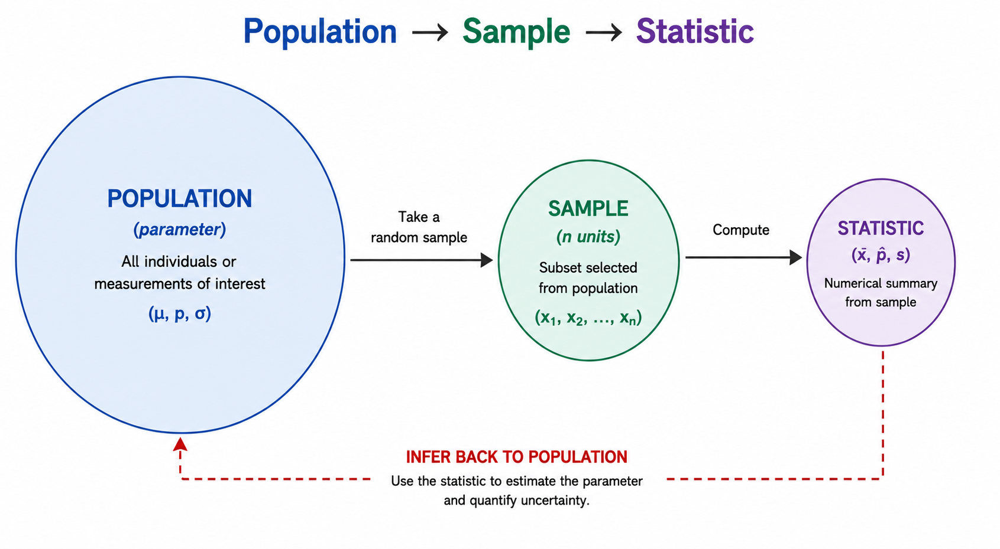

# Chapter 1: Introduction {.title-slide}

<style>
:root {
  --sta-teal: #00695c;
  --sta-teal-dark: #004d40;
  --sta-text: #2f3437;
  --sta-muted: #5f6b73;
  --sta-blue-bg: #c8e6f3;
  --sta-blue-soft: #eef8fb;
  --sta-grey-bg: #eeeeee;
  --sta-yellow-bg: #fff8e1;
  --sta-yellow-border: #f9a825;
  --sta-red-bg: #ffebee;
  --sta-red-border: #c62828;
  --sta-border: #d8dee2;
}

.reveal {
  font-family: Arial, sans-serif;
  color: var(--sta-text);
}

.reveal h1,
.reveal h2,
.reveal h3 {
  color: var(--sta-text);
  line-height: 1.1;
}

.reveal h1 {
  font-size: 1.72em !important;
}

.reveal h2 {
  border-bottom: 3px solid var(--sta-teal);
  padding-bottom: 4px;
  margin-bottom: 12px;
  font-size: 1.50em !important;
}

.reveal h3 {
  font-size: 1.12em !important;
}

.title-slide {
  text-align: center;
}

.reveal p,
.reveal li {
  font-size: 0.78em;
  line-height: 1.34;
}

.defbox,
.examplebox,
.thinkbox,
.warnbox,
.card,
.stat-card {
  padding: 14px 16px;
  border-radius: 10px;
  font-size: 0.72em;
  line-height: 1.24;
  box-sizing: border-box;
  margin-bottom: 8px;
}

.defbox {
  background: var(--sta-blue-bg);
  border-left: 7px solid var(--sta-teal);
}

.examplebox {
  background: var(--sta-grey-bg);
}

.thinkbox {
  background: var(--sta-yellow-bg);
  border-left: 7px solid var(--sta-yellow-border);
}

.warnbox {
  background: var(--sta-red-bg);
  border-left: 7px solid var(--sta-red-border);
}

.card {
  background: linear-gradient(160deg, var(--sta-blue-bg), var(--sta-blue-soft));
  border-left: 7px solid var(--sta-teal);
}

.stat-card {
  background: white;
  border: 1px solid var(--sta-border);
  box-shadow: 0 1px 4px rgba(0,0,0,0.07);
}

.card .label,
.stat-card .label {
  display: block;
  color: var(--sta-teal-dark);
  font-weight: 700;
  margin-bottom: 5px;
}

.big {
  font-size: 1.08em;
  font-weight: bold;
  color: var(--sta-teal);
}

.defbox p,
.examplebox p,
.thinkbox p,
.warnbox p,
.card p,
.stat-card p,
.defbox li,
.examplebox li,
.thinkbox li,
.warnbox li,
.card li,
.stat-card li {
  font-size: 1em;
  margin-bottom: 4px;
}

.footer-note {
  font-size: 0.65em;
  color: var(--sta-muted);
}

.center {
  text-align: center;
}

.small-text {
  font-size: 0.75em;
}

.reveal table {
  font-size: 0.85em;
}

.answer-table td {
  background: var(--sta-grey-bg);
}

.answer-table th {
  background: var(--sta-blue-bg);
}

.scrollable .defbox,
.scrollable .examplebox,
.scrollable .thinkbox,
.scrollable .warnbox {
  margin-bottom: 4px;
}

/* ── Grid layouts ─────────────────────────────────────── */
.three-col {
  display: grid;
  grid-template-columns: repeat(3, 1fr);
  gap: 28px;
  align-items: start;
}

/* ── Home button ──────────────────────────────────────── */
.reveal a.home-button,
.reveal a.home-button:visited,
.reveal a.home-button:link {
  display: inline-block !important;
  background: var(--sta-teal) !important;
  background-color: var(--sta-teal) !important;
  color: white !important;
  padding: 12px 28px !important;
  border-radius: 10px !important;
  text-decoration: none !important;
  font-weight: 700 !important;
  font-size: 0.9em !important;
  border: 2px solid var(--sta-teal-dark) !important;
  margin-top: 24px !important;
  opacity: 1 !important;
  visibility: visible !important;
}

.reveal a.home-button:hover {
  background: var(--sta-teal-dark) !important;
  background-color: var(--sta-teal-dark) !important;
  color: white !important;
}

.home-button-row {
  text-align: center;
  margin-top: 32px;
}
</style>



STA258: Statistics with Applied Probability
University of Toronto Mississauga

{width="245" fig-alt="Course mascot"}

::: notes
Welcome students. Set the tone: this course is about reasoning under uncertainty, not just plugging numbers into formulas.
:::

---

## The Big Question {#big-question .scrollable}

<div class="center">
<span class="big">How can we say something true about<br>millions of people we've never met?</span>
</div>

<br>

<div class="examplebox fragment">
Pollsters call ~1,000 Canadians and predict an election for 40 million.<br>
Doctors test a drug on 500 patients and recommend it for everyone.<br>
Netflix watches a sample of users and decides what shows to make.
</div>

<div class="thinkbox fragment">
That gap between "what we measured" and "what we want to know" - that's what this whole course is about.
</div>

---

## Roadmap {#roadmap .scrollable}

:::: {.three-col}
::: {.card .fragment}
<span class="label">1 - Foundations</span>
Statistics, population, sample, unit, observation, variable, and the difference between descriptive and inferential ideas.
:::
::: {.card .fragment}
<span class="label">2 - Types of Data</span>
Quantitative vs qualitative data, plus discrete vs continuous and nominal vs ordinal categories.
:::
::: {.card .fragment}
<span class="label">3 - Inference Preview</span>
Sampling, bias, study types, and the first ideas behind drawing conclusions from data.
:::
::::

<br>

:::: {.three-col}
::: {.stat-card .fragment}
<span class="label">Core skill</span>
Thinking carefully about what data represent before you compute anything.
:::
::: {.stat-card .fragment}
<span class="label">Core tool</span>
Vocabulary like population, sample, parameter, statistic, and variable.
:::
::: {.stat-card .fragment}
<span class="label">Core habit</span>
Match every numerical claim with the correct data context.
:::
::::

---

## 1.1 Foundations {.scrollable}

<div class="defbox">
<strong>Definition 1.1 - Statistics</strong><br>
The science of <strong>collecting, classifying, summarizing, analyzing, and interpreting data</strong>.
</div>

<br>

<div class="examplebox fragment">
Think of statistics as a pipeline:
<br><br>
<span class="big">Question → Data → Analysis → Decision</span>
</div>

::: notes
The five verbs in the definition map roughly to the chapters of the course.
:::

---

## Population {#population .scrollable}

<div class="defbox">
<strong>Definition 1.2 - Population</strong><br>
The <strong>entire group</strong> of individuals, items, or measurements that share a characteristic of interest and about which conclusions are to be drawn.
</div>

::: {.examplebox .fragment}
**Examples:**

- All students at the University of Toronto
- All residents of Mississauga
- Every possible hand in a game of poker (hypothetical!)
- Every battery a factory will ever produce
:::

<div class="thinkbox fragment">
A population can be real or hypothetical, finite or essentially infinite. What matters is that it's the group you actually want to learn about.
</div>

---

## Sample {#sample .scrollable}

<div class="defbox">
<strong>Definition 1.3 - Sample</strong><br>
A <strong>subset</strong> selected from the population.
</div>

::: {.examplebox .fragment}
**Examples:**

- 50 randomly selected U of T students
- 100 randomly selected Mississauga residents
- 30 batteries pulled off the production line today
:::

<div class="thinkbox fragment">
<strong>Why sample?</strong> Measuring everyone is usually too slow, too expensive, or simply impossible.
</div>

---

## Visualizing Population vs Sample {.scrollable}

```{r}
#| echo: false
#| fig-width: 9
#| fig-height: 4.5
set.seed(1)
N <- 400
pop <- data.frame(
  id    = 1:N,
  x     = runif(N, 0, 10),
  y     = runif(N, 0, 5),
  group = "Population"
)
samp_idx <- sample(N, 30)
pop$group[samp_idx] <- "Sample"

library(ggplot2)
library(plotly)
p <- ggplot(pop, aes(x, y, colour = group, size = group,
                     text = paste0("Unit #", id, "<br>", group))) +
  geom_point(alpha = 0.85) +
  scale_colour_manual(values = c("Population" = "#bdbdbd", "Sample" = "#00695c")) +
  scale_size_manual(values = c("Population" = 2, "Sample" = 4)) +
  theme_void() +
  theme(legend.title = element_blank(), legend.position = "bottom")

ggplotly(p, tooltip = "text", height = 380) |>
  config(displayModeBar = FALSE)
```

::: {.footer-note .center}
Hover over any dot to see which unit it is. Grey = population, teal = the sample.
:::

---

## Your Turn: Identify Them {#poll-pop-sample .scrollable}

<div class="thinkbox">
A researcher wants to know the average sleep of all UTM students. She randomly surveys 200 UTM students and finds they sleep 6.8 hours on average.
<br><br>
What is the <strong>population</strong>?  What is the <strong>sample</strong>?
</div>

<div class="examplebox fragment">
<strong>Population:</strong> All UTM students.<br>
<strong>Sample:</strong> The 200 surveyed UTM students.
</div>

::: notes
Pause and have students answer aloud before revealing.
:::

---

## Unit, Observation, Variable {#unit-observation-variable .scrollable}

<div class="defbox">
<strong>Unit</strong> - the smallest entity from which data are collected (one row).
</div>

<div class="defbox">
<strong>Observation</strong> - the full set of measured values for one unit.
</div>

<div class="defbox">
<strong>Variable</strong> - a characteristic that varies from unit to unit (one column).
</div>

---

## Reading a Data Table {.scrollable}

| Student | Age | Program | Study Hours | On Campus |
|:---:|:---:|:---|:---:|:---:|
| 1 | 19 | Statistics | 20 | Yes |
| 2 | 22 | Computer Science | 15 | No |
| 3 | 20 | Biology | 28 | Yes |
| 4 | 21 | Psychology | 18 | No |

::: {.examplebox .fragment}
- Each **row** is one observation (one student)
- Each **column** is one variable
- The **unit** is a single student
:::

---

## Try It in R {#try-data .scrollable}

```{webr}
#| autorun: true
#| caption: A small student data set

students <- data.frame(
  age          = c(19, 22, 20, 21),
  program      = c("Stats", "CS", "Bio", "Psych"),
  study_hours  = c(20, 15, 28, 18),
  on_campus    = c("Yes", "No", "Yes", "No")
)

students
nrow(students)   # how many observations?
ncol(students)   # how many variables?
```

<div class="footer-note">
Run it. Then change a value or add another student.
</div>

---

## Population Unit vs Sample Unit {.scrollable}

::::: columns
::: {.column width="50%"}
<div class="defbox">
<strong>Population unit</strong><br>
One member of the entire population.
</div>

<div class="examplebox">
One U of T student, when the population is all U of T students.
</div>
:::

::: {.column width="50%"}
<div class="defbox">
<strong>Sample unit</strong><br>
One member of the selected sample.
</div>

<div class="examplebox">
One of the 50 students you actually surveyed.
</div>
:::
:::::

<div class="thinkbox fragment">
Every sample unit is also a population unit - but not the other way around.
</div>

---

## Parameter vs Statistic {#parameter-vs-statistic .scrollable}

::::: columns
::: {.column width="50%"}
<div class="defbox">
<strong>Parameter</strong><br>
A number that describes the <strong>population</strong>.<br><br>
Usually <strong>unknown</strong>.
</div>
:::

::: {.column width="50%"}
<div class="defbox">
<strong>Statistic</strong><br>
A number that describes the <strong>sample</strong>.<br><br>
Calculated from data - <strong>known</strong>.
</div>
:::
:::::

<div class="thinkbox fragment">
<strong>Memory trick:</strong> &nbsp; Parameter ↔ Population &nbsp;|&nbsp; Statistic ↔ Sample &nbsp;(both start with the same letter).
</div>

---

## Notation You Need to Memorize {.scrollable}

| Quantity | Population (parameter) | Sample (statistic) |
|:---|:---:|:---:|
| Mean | $\mu$ | $\bar{x}$ |
| Standard deviation | $\sigma$ | $s$ |
| Proportion | $p$ | $\hat{p}$ |
| Size | $N$ | $n$ |

<br>

<div class="examplebox">
<strong>Greek letters → population.</strong> &nbsp; <strong>Roman letters (or hats) → sample.</strong>
</div>

::: notes
Stress this. Most algebra errors later in the course come from mixing $p$ with $\hat{p}$ or $\sigma$ with $s$.
:::

---

## Quick Check {#qc-param-stat .scrollable}

<div class="thinkbox">
For each, decide: <strong>parameter</strong> or <strong>statistic</strong>?
<ol>
<li>The average height of all NBA players.</li>
<li>63% of 500 surveyed Canadians support a policy.</li>
<li>The sample mean GPA of 80 UTM students is 3.12.</li>
<li>The standard deviation of grades for every student who has ever taken STA258.</li>
</ol>
</div>

<div class="examplebox fragment">
1 - parameter (all NBA players)<br>
2 - statistic (500 surveyed)<br>
3 - statistic (80 students)<br>
4 - parameter (every student ever)
</div>

---

## Compute a Statistic Yourself {#compute-stat .scrollable}

Below are weekly study hours for a sample of 10 students.<br>
Calculate the sample mean.

```{webr}
#| exercise: sample_mean

study_hours <- c(12, 18, 25, 9, 22, 30, 15, 20, 17, 28)

# Fill in the blank to compute the sample mean
______(study_hours)
```

::: {.solution exercise="sample_mean"}
::: {.callout-tip title="Solution"}
```r
mean(study_hours)   # 19.6
```
This is $\bar{x}$, our estimate of the unknown population mean $\mu$.
:::
:::

---

## Exercise: Inference {.scrollable}

<div class="thinkbox">
A student wellness survey is sent to <strong>500 randomly selected undergraduates</strong> on campus, out of a total enrolled population of roughly <strong>15,000 students</strong>. The survey asks whether the student reports <strong>high levels of academic stress</strong>.
</div>

::: {.nonincremental}
1. Identify the population.
2. Identify the sample.
3. What is the parameter of interest?
4. What is the corresponding statistic?
5. Why do we use the statistic to draw conclusions about the parameter, rather than computing the parameter directly?
:::

---

## Descriptive vs Inferential Statistics {#descriptive-vs-inferential-statistics .scrollable}

<div class="defbox">
<strong>Descriptive statistics</strong><br>
Numerical and graphical methods used to <strong>summarize</strong> the data you have.
</div>

<div class="defbox">
<strong>Inferential statistics</strong><br>
Using a sample to <strong>generalize</strong> to a larger population.
</div>

---

## Spot the Difference {.scrollable}

::::: columns
::: {.column width="50%"}
#### Descriptive

<div class="examplebox">
"The average mark in this lecture of 80 students is 72%."
<br><br>
"63% of <em>these</em> 400 Torontonians support the plan."
</div>
:::

::: {.column width="50%"}
#### Inferential

<div class="examplebox">
"We estimate the average STA258 mark <em>across all sections</em> is around 72%."
<br><br>
"We estimate ~63% of <em>all</em> Toronto residents support the plan."
</div>
:::
:::::

<div class="thinkbox fragment">
<strong>Tell:</strong> descriptive describes <em>this data</em>. Inferential makes a claim <em>beyond</em> the data.
</div>

---

## 1.2 Types of Data {.scrollable}

<div class="defbox">
<strong>Quantitative data</strong><br>
Numerical measurements where arithmetic is meaningful.
</div>

<div class="defbox">
<strong>Qualitative (categorical) data</strong><br>
Values fall into <strong>categories</strong>; arithmetic doesn't make sense.
</div>

<div class="warnbox fragment">
<strong>Trap:</strong> a number doesn't automatically mean quantitative.<br>
Postal codes, jersey numbers, and student IDs <em>look</em> numeric but are categorical.
</div>

---

## Quantitative: Discrete vs Continuous {.scrollable}

::::: columns
::: {.column width="50%"}
<div class="defbox">
<strong>Discrete</strong><br>
Countable values, often whole numbers.
</div>

::: {.examplebox .fragment}
- Number of siblings
- Courses enrolled in
- Defective items in a batch
:::
:::

::: {.column width="50%"}
<div class="defbox">
<strong>Continuous</strong><br>
Any value in a range; measured on a scale.
</div>

::: {.examplebox .fragment}
- Height
- Time spent studying
- Temperature
:::
:::
:::::

---

## Qualitative: Nominal vs Ordinal {.scrollable}

::::: columns
::: {.column width="50%"}
<div class="defbox">
<strong>Nominal</strong><br>
Categories with <strong>no natural order</strong>.
</div>

::: {.examplebox .fragment}
- Eye colour
- Program of study
- Primary device (phone/laptop/tablet)
:::
:::

::: {.column width="50%"}
<div class="defbox">
<strong>Ordinal</strong><br>
Categories with a <strong>natural order</strong>.
</div>

::: {.examplebox .fragment}
- Self-rated health (Poor → Excellent)
- Movie rating (1–5 stars)
- Education level
:::
:::
:::::

---

## Classify These {#classify-exercise .scrollable}

Try classifying each one. Then click for the answer.

| Variable | Type |
|:---|:---|
| Number of pets a student owns | [Quantitative, **discrete**]{.fragment} |
| Language spoken at home | [Qualitative, **nominal**]{.fragment} |
| Backpack weight (kg) | [Quantitative, **continuous**]{.fragment} |
| Postal code | [Qualitative, **nominal**]{.fragment} |
| Classroom temperature (°C) | [Quantitative, **continuous**]{.fragment} |
| Self-rated health (Poor/Fair/Good) | [Qualitative, **ordinal**]{.fragment} |

---

## Exercise: Types of Data {.scrollable}

<div class="thinkbox">
Classify each variable as <strong>quantitative</strong> or <strong>qualitative</strong>. For each quantitative one, also say whether it is <strong>discrete</strong> or <strong>continuous</strong>. We will go through these together in class.
</div>

::: {.nonincremental}
- Age
- Age cohort (e.g. 18-25, 26-35)
- Weight
- Gender
- Cost of a textbook
- Major at university
- Classroom seating capacity
- Interest rate
- Average annual return of a stock
- Shoe size
- Year of university (by credits completed)
- A student's academic program (e.g. Statistics, Economics)
- The campus a student attends (UTM, UTSG, UTSC)
- Letter grade received in a course (A+, A, A-, B+, ...)
- Response on a course evaluation (Strongly Agree, ..., Strongly Disagree)
:::

---

## Check Data Types in R {#check-types .scrollable}

R can tell you what type each variable is. Run it, then change a value.

```{webr}
#| autorun: true
#| caption: class() reports the data type R is storing

age      <- 20
program  <- "Statistics"
on_campus <- TRUE
pets     <- 2L

class(age)        # numeric  → quantitative continuous
class(program)    # character → qualitative
class(on_campus)  # logical  → qualitative (2 categories)
class(pets)       # integer  → quantitative discrete
```

---

## 1.3 Introduction to Inferential Statistics {#introduction-to-inferential-statistics}

<div class="center">
```{r}
#| echo: false

```
</div>

---

## Why Uncertainty Is Built In

<div class="examplebox">
Two different samples of 100 UTM students will give two <strong>different</strong> sample means.<br><br>
So any estimate must come with a measure of how much it might be off.
</div>

::: {.thinkbox .fragment}
This is where the tools in later chapters come from:

- **Confidence intervals** - a range of plausible parameter values
- **Hypothesis tests** - checking whether data support a specific claim
- **Statistical power** - how likely we are to detect a real effect
:::

---

## See Sampling Variability {#see-variability .scrollable}

```{webr}
#| autorun: false
#| caption: Each click draws a new sample of 30 from a population with mean 70.

set.seed(NULL)
population <- rnorm(10000, mean = 70, sd = 10)
sample_30  <- sample(population, 30)
mean(sample_30)
```

<div class="footer-note">
Run it 5 times. Notice the sample mean changes each time - even though the true population mean is exactly 70.
</div>

---

## A Closer Look at Sampling {#sampling-methods .scrollable}

How you collect your sample determines whether inference is honest.

<div class="defbox" style="font-size:0.85em">
<strong>Simple random sample (SRS)</strong> - every unit has an equal chance of being chosen.
</div>

<div class="defbox" style="font-size:0.85em">
<strong>Systematic</strong> - every $k$-th unit from an ordered list (e.g., every 50th student).
</div>

<div class="defbox" style="font-size:0.85em">
<strong>Stratified</strong> - divide into groups, sample from each group.
</div>

<div class="defbox" style="font-size:0.85em">
<strong>Cluster</strong> - randomly pick whole groups, survey everyone inside.
</div>

<div class="defbox" style="font-size:0.85em">
<strong>Convenience / Voluntary response</strong> - whoever is easy to reach or chooses to respond. ⚠ Usually biased.
</div>

---

## Bias: When Samples Lie {.scrollable}

<div class="defbox">
<strong>Bias</strong> - a systematic tendency for a sample to differ from the population in a particular direction.
</div>

<br>

::: {.warnbox .fragment}
**Classic bias traps:**

- **Selection bias** - surveying gym-goers about exercise habits
- **Voluntary response** - Instagram polls (only loud opinions answer)
- **Non-response bias** - the people who skip the survey are different from those who answer
- **Coverage bias** - your sampling frame misses parts of the population
:::

---

## Exercise: Identify the Bias {.scrollable}

<div class="thinkbox">
For each scenario, identify the type of bias present and explain why it is a problem. We will discuss in class.
</div>

::: {.nonincremental}
1. The Office of the Registrar wants to estimate the average GPA of all undergraduates. They collect data by emailing only students who belong to an academic club.
2. A student newspaper posts an online poll asking "How satisfied are you with library hours?" and reports the results as representative of all students.
3. A course evaluation survey is sent to a random sample of 1,000 students, but only 200 respond.
4. A study on student commuting habits recruits participants by posting flyers only in on-campus residence buildings.
5. A survey asks students to self-report how many hours per week they spend studying.
:::

---

## Observational vs Experimental Studies {#study-types .scrollable}

::::: columns
::: {.column width="50%"}
<div class="defbox">
<strong>Observational</strong><br>
Record what's already happening - no intervention.
</div>

<div class="examplebox">
Survey adults: do you take vitamins? Did you catch a cold?
</div>
:::

::: {.column width="50%"}
<div class="defbox">
<strong>Experimental</strong><br>
Randomly assign participants to treatments, then compare.
</div>

<div class="examplebox">
Randomly give half the volunteers Vitamin C, half a placebo, and compare cold rates.
</div>
:::
:::::

<div class="thinkbox fragment">
Only well-designed <strong>experiments</strong> can establish cause and effect.
</div>

---

## Exercise: Types of Studies {.scrollable}

<div class="thinkbox">
Classify each as an <strong>observational study</strong>, <strong>experimental study</strong>, or <strong>sample survey</strong>. Briefly justify your answer. We will take these up in class.
</div>

::: {.nonincremental}
1. A researcher records the GPA and weekly study hours of students in STA258 without intervening, to see whether there is an association between the two.
2. First-year students are randomly assigned to either a weekly tutoring program or no tutoring. Their final exam grades are compared at the end of term.
3. At the end of the semester, a random sample of students is emailed a questionnaire asking about teaching quality, workload, and course organization.
4. A study tracks whether students who commute more than 1 hour to campus report higher stress levels than those who live on campus.
5. Students are randomly given one of two versions of a course syllabus (one with weekly deadlines, one with monthly deadlines) and their assignment submission rates are recorded.
:::

---

## Chapter 1 Summary {#chapter-1-summary .scrollable}

<div class="examplebox">
<ol>
<li>Statistics = science of learning from data under uncertainty.</li>
<li>We study a <strong>sample</strong> to learn about a <strong>population</strong>.</li>
<li><strong>Parameters</strong> describe populations (unknown); <strong>statistics</strong> describe samples (known).</li>
<li>Data are <strong>quantitative</strong> (discrete/continuous) or <strong>qualitative</strong> (nominal/ordinal).</li>
<li>Inference uses a sample statistic to estimate an unknown population parameter - with a measure of uncertainty.</li>
<li><strong>How</strong> we sample (and whether we experiment) determines whether inference is trustworthy.</li>
</ol>
</div>

---

## What's Next {.scrollable}

<div class="thinkbox">
<strong>Chapter 2:</strong> we move into R - the tool we'll use to compute statistics, simulate samples, and visualize uncertainty.
</div>

<br>

<div class="center">
<span class="big">End of Chapter 1</span><br><br>
<div class="home-button-row">
<a href="../index.html" class="home-button">Back to Course Home</a>
</div>
</div>

---

## Bonus Practice {.scrollable}

Below are some ages of UTM students in a sample. Compute:

1. The sample size $n$
2. The sample mean $\bar{x}$
3. The sample standard deviation $s$

```{webr}
#| exercise: bonus_practice

ages <- c(19, 22, 20, 21, 23, 19, 20, 24, 22, 20, 21, 19)

# Fill in:
n  <- ______(ages)
xbar <- ______(ages)
s  <- ______(ages)

c(n = n, xbar = xbar, s = s)
```

::: {.solution exercise="bonus_practice"}
::: {.callout-tip title="Solution"}
```r
n    <- length(ages)
xbar <- mean(ages)
s    <- sd(ages)
```
$n = 12$, $\bar{x} \approx 20.83$, $s \approx 1.59$.
:::
:::