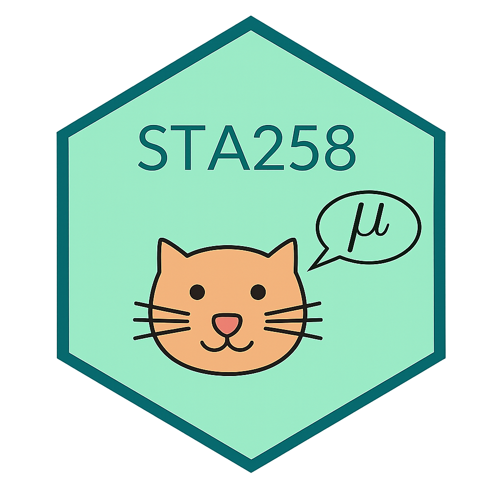

```{r setup}
#| include: false
library(ggplot2)
library(dplyr)
library(plotly)

theme_set(theme_minimal(base_size = 13))
set.seed(258)

plot_cols <- list(
  main        = "#00695c",
  teal        = "#00695c",
  teal_dark   = "#004d40",
  teal_light  = "#e0f2f1",
  blue        = "#c8e6f3",
  blue_soft   = "#eef8fb",
  grey        = "#f5f6f7",
  gray        = "#f5f6f7",
  yellow      = "#fff8e1",
  orange      = "#f9a825",
  text        = "#2f3437",
  muted       = "#667174",
  border      = "#d8dee2",
  code        = "#f3f4f5",
  white       = "#ffffff"
)

plotly_slide_layout <- function(
  p,
  title = NULL,
  x_title = NULL,
  y_title = NULL,
  width = NULL,
  height = 390,
  x_range = NULL,
  y_range = NULL,
  margin = list(l = 70, r = 25, t = 70, b = 60)
) {
  p |>
    layout(
      title = list(
        text = title,
        font = list(size = 16),
        x = 0.02
      ),
      width = width,
      height = height,
      margin = margin,
      xaxis = list(
        title = x_title,
        range = x_range,
        zeroline = FALSE,
        showline = TRUE,
        linecolor = plot_cols$border,
        gridcolor = "rgba(0,0,0,0.08)"
      ),
      yaxis = list(
        title = y_title,
        range = y_range,
        zeroline = FALSE,
        showline = TRUE,
        linecolor = plot_cols$border,
        gridcolor = "rgba(0,0,0,0.08)"
      ),
      paper_bgcolor = "rgba(0,0,0,0)",
      plot_bgcolor = "white"
    ) |>
    config(
      displayModeBar = FALSE,
      displaylogo = FALSE,
      responsive = TRUE,
      scrollZoom = FALSE,
      doubleClick = FALSE
    )
}
```

# Chapter 5: Confidence Intervals {.title-slide}

<style>
:root {
  --sta-teal: #00695c;
  --sta-teal-dark: #004d40;
  --sta-teal-light: #e0f2f1;
  --sta-blue: #c8e6f3;
  --sta-blue-soft: #eef8fb;
  --sta-grey: #f5f6f7;
  --sta-yellow: #fff8e1;
  --sta-orange: #f9a825;
  --sta-text: #2f3437;
  --sta-muted: #667174;
  --sta-border: #d8dee2;
  --sta-code: #f3f4f5;
}
.reveal { font-family: Arial, sans-serif; color: var(--sta-text); }
.reveal .slides section { text-align: left; padding: 18px 30px; box-sizing: border-box; }
.reveal h1, .reveal h2, .reveal h3 { color: var(--sta-text); line-height: 1.1; }
.reveal h1 { font-size: 1.72em !important; }
.reveal h2 {
  font-size: 1.52em !important;
  border-bottom: 3px solid var(--sta-teal);
  padding-bottom: 4px;
  margin-bottom: 12px;
}
.reveal h3 { font-size: 1.05em !important; margin-bottom: 0.2em; }
.reveal p, .reveal li { font-size: 0.76em; line-height: 1.32; }
.title-slide { text-align: center !important; }
.title-slide h1 { font-size: 1.72em !important; margin-top: 0.4em; }
.title-slide p { font-size: 0.78em; color: var(--sta-muted); }
.two-col, .two-col-lean, .two-col-wide, .three-col, .four-grid, .exercise-grid {
  display: grid;
  gap: 24px;
  align-items: start;
}
.two-col { grid-template-columns: 1fr 1fr; }
.two-col-lean { grid-template-columns: 0.9fr 1.1fr; }
.two-col-wide { grid-template-columns: 1.12fr 0.88fr; }
.three-col { grid-template-columns: repeat(3, 1fr); }
.four-grid { grid-template-columns: repeat(2, 1fr); }
.exercise-grid { grid-template-columns: 360px 1fr; gap: 24px; }
.col { min-width: 0; }
.defbox, .examplebox, .thinkbox, .card, .warnbox, .taskbox, .notebox, .mini-card, .stat-card {
  padding: 14px 16px;
  border-radius: 10px;
  font-size: 0.72em;
  line-height: 1.28;
  box-sizing: border-box;
  margin-bottom: 8px;
}
.defbox, .card {
  background: linear-gradient(160deg, var(--sta-blue), var(--sta-blue-soft));
  border-left: 7px solid var(--sta-teal);
}
.sample-size-selection .defbox {
  padding: 10px 16px;
  font-size: 0.66em;
  line-height: 1.16;
  margin-bottom: 4px;
}
.sample-size-selection .defbox p {
  margin: 0.18em 0;
}
.sample-size-selection .defbox blockquote {
  margin: 0.28em 0 0.42em 0.28em;
  padding: 0.18em 0 0.18em 0.72em;
}
.pooled-example-compact .taskbox {
  padding: 12px 16px;
  font-size: 0.68em;
  line-height: 1.18;
  margin-bottom: 10px;
}
.pooled-example-compact .math.display {
  margin: 0.28em 0;
  font-size: 0.78em;
}
.pooled-example-compact .examplebox {
  margin-top: 10px;
  padding: 12px 16px;
  font-size: 0.66em;
}
.known-sigma-example .math.display {
  font-size: 0.84em;
  margin: 0.36em 0;
}
.paired-visual-fit .cell,
.paired-visual-fit .cell-output-display,
.paired-visual-fit .html-widget,
.paired-visual-fit .plotly,
.paired-visual-fit .plot-container,
.paired-visual-fit .svg-container {
  width: 100% !important;
  max-width: 1080px !important;
  height: 330px !important;
  max-height: 330px !important;
  overflow: hidden !important;
  margin-left: auto !important;
  margin-right: auto !important;
}
.paired-visual-fit .thinkbox {
  margin-top: 14px;
}
.sample-size-mean-example .taskbox {
  margin-bottom: 14px;
}
.sample-size-mean-example table {
  margin-top: 12px;
  margin-bottom: 18px;
}
.sample-size-mean-example .thinkbox {
  margin-top: 18px;
}
.examplebox, .notebox, .mini-card {
  background: var(--sta-grey);
  border: 1px solid var(--sta-border);
}
.thinkbox, .taskbox {
  background: var(--sta-yellow);
  border-left: 7px solid var(--sta-orange);
}
.warnbox { background: #fff3e0; border-left: 7px solid #ef6c00; }
.stat-card {
  background: white;
  border: 1px solid var(--sta-border);
  box-shadow: 0 1px 4px rgba(0,0,0,0.07);
}
.card .label, .taskbox .label, .notebox .label, .mini-card .label, .stat-card .label {
  display: block;
  color: var(--sta-teal-dark);
  font-weight: 700;
  margin-bottom: 5px;
}
.big { font-size: 1.08em; font-weight: bold; color: var(--sta-teal); }
.center { text-align: center; }
.small-text { font-size: 0.62em; }
.tight li { margin-bottom: 0.16em; }
.formula {
  display: inline-block;
  background: white;
  border: 1px solid var(--sta-border);
  border-radius: 8px;
  padding: 5px 10px;
  font-family: "SFMono-Regular", Consolas, monospace;
  font-size: 1.02em;
}
.reveal table {
  width: 100%;
  border-collapse: collapse;
  border: 1.25px solid #4d5659;
  font-size: 0.62em;
}
.reveal th, .reveal td {
  border: 1.25px solid #4d5659;
  padding: 6px 8px;
  vertical-align: top;
}
.reveal th { background: var(--sta-teal-light); font-weight: bold; }
.reveal pre { width: 100%; margin-top: 0.3em; margin-bottom: 0.3em; border-radius: 8px; }
.reveal pre code { font-size: 0.72em; max-height: 320px; }
.reveal code { background: var(--sta-code); border-radius: 4px; padding: 1px 4px; }
.reveal .slides section.scrollable { overflow-y: auto !important; overflow-x: hidden !important; max-height: 700px; }
.reveal section.compact h2 { font-size: 1.1em !important; }
.reveal section.compact p, .reveal section.compact li { font-size: 0.72em; }
.reveal section.quiz-question {
  display: flex !important;
  flex-direction: column !important;
  justify-content: center !important;
  align-items: stretch !important;
  height: 100%;
}
.reveal .quiz-question > * { width: 100%; max-width: 1080px; }
.reveal .quiz-question h2 { font-size: 1.1em !important; margin-bottom: 10px; text-align: center; }
.reveal .quiz-question .callout-note { margin: 4px 0 12px 0 !important; text-align: left; }
.reveal .quiz-question .callout-note .callout-body p, .reveal .quiz-question .callout-note p {
  font-size: 0.76em !important;
  line-height: 1.28;
  margin: 4px 0;
}
.reveal .quiz-question .callout-title { font-size: 0.82em !important; padding: 5px 12px !important; }
.reveal .quiz-question ul { margin: 4px 0 !important; padding-left: 0 !important; list-style: none !important; }
.reveal .quiz-question li { margin-bottom: 6px !important; }
.reveal section.quiz-question img {
  max-height: 235px !important;
  object-fit: contain !important;
  margin: 2px auto 6px auto !important;
  display: block !important;
}
.reveal .option-button {
  padding: 9px 16px !important;
  margin-bottom: 7px !important;
  font-size: 0.82em !important;
  line-height: 1.25 !important;
  border-radius: 8px !important;
  text-align: left !important;
}
.reveal .action-buttons { margin: 10px 0 0 0 !important; font-size: 0.85em !important; text-align: right; }
.reveal .check-button, .reveal .reset-button, .reveal .prev-button, .reveal .next-button {
  padding: 7px 16px !important;
  font-size: 0.78em !important;
  border-radius: 6px !important;
  margin: 0 4px !important;
}
.reveal .feedback, .reveal .explanation, .reveal .quiz-question .explanation {
  font-size: 0.7em !important;
  margin-top: 8px;
}
.quiz-hint { font-size: 0.6em; color: var(--sta-muted); font-style: italic; margin: 0 0 6px 0; }
.callout { font-size: 0.75em; }
.reveal .assumption-stack {
  display: grid;
  grid-template-columns: minmax(0, 1fr);
  gap: 12px;
  max-width: 900px;
  margin: 0 auto;
}
.reveal .assumption-stack .card,
.reveal .assumption-stack .warnbox {
  margin-bottom: 0;
  padding: 12px 16px;
  font-size: 0.6em;
}
.reveal .assumption-stack .label {
  font-size: 1.08em;
  margin-bottom: 7px;
}
.reveal .assumption-list {
  list-style: none !important;
  margin: 8px 0 0 0 !important;
  padding-left: 0 !important;
  display: grid;
  gap: 7px;
}
.reveal .assumption-list li {
  position: relative;
  padding-left: 24px;
  font-size: 0.92em !important;
  line-height: 1.2;
  margin-bottom: 0 !important;
}
.reveal .assumption-list li::before {
  content: "";
  position: absolute;
  left: 2px;
  top: 0.58em;
  width: 8px;
  height: 8px;
  border-radius: 50%;
  background: var(--sta-teal);
}
.reveal .assumption-stack p {
  font-size: 0.92em !important;
  line-height: 1.22;
  margin: 4px 0 0 0;
}
.reveal .assumption-formula {
  text-align: center;
  font-size: 1.0em !important;
  margin: 4px auto 0 auto;
}
.reveal .assumption-formula p {
  font-size: 1em !important;
}
.ci-widget {
  background: white;
  border: 1px solid var(--sta-border);
  border-radius: 10px;
  padding: 12px 16px;
  font-size: 0.72em;
}
.ci-widget label { display: block; font-weight: 700; color: var(--sta-teal-dark); margin-top: 7px; }
.ci-widget input, .ci-widget select {
  width: 100%;
  box-sizing: border-box;
  padding: 6px 8px;
  border: 1px solid var(--sta-border);
  border-radius: 6px;
}
.ci-sim-plot,
.ci-sim-plot .cell,
.ci-sim-plot .cell-output-display,
.ci-sim-plot .html-widget,
.ci-sim-plot .plotly,
.ci-sim-plot .plot-container,
.ci-sim-plot .svg-container {
  width: 100% !important;
  max-width: 430px !important;
  height: 320px !important;
  max-height: 320px !important;
  overflow: hidden !important;
  margin: 0 auto !important;
}
.ci-result {
  margin-top: 10px;
  padding: 10px 12px;
  border-radius: 8px;
  background: var(--sta-teal-light);
  font-weight: 700;
}
.home-button-row { text-align: center; margin-top: 32px; }
.reveal a.home-button, .reveal a.home-button:visited, .reveal a.home-button:link {
  display: inline-block !important;
  background: var(--sta-teal) !important;
  color: white !important;
  padding: 12px 28px !important;
  border-radius: 10px !important;
  text-decoration: none !important;
  font-weight: 700 !important;
  font-size: 0.9em !important;
  border: 2px solid var(--sta-teal-dark) !important;
  margin-top: 24px !important;
}
.reveal a.home-button:hover { background: var(--sta-teal-dark) !important; color: white !important; }
</style>



STA258: Statistics with Applied Probability  
University of Toronto Mississauga

{width="245" fig-alt="Course mascot"}

---

## Chapter Roadmap {.compact}

:::: {.three-col}
::: {.card .fragment}
<span class="label">5.1–5.3 - Foundations and One-Sample Intervals</span>
Point and interval estimates, confidence interpretation, and intervals
for one mean, one proportion, and one variance.
:::

::: {.card .fragment}
<span class="label">5.4–5.5 - Comparing Groups</span>
Two-sample and paired intervals for mean differences, proportion
differences, and variance ratios.
:::

::: {.card .fragment}
<span class="label">5.6 - Sample Size Planning</span>
Choose the required sample size so a confidence interval reaches a
target margin of error.
:::
::::

<br>

:::: {.three-col}
::: {.stat-card .fragment}
<span class="label">Core skill</span>
Identify the parameter before choosing the formula.
:::
::: {.stat-card .fragment}
<span class="label">Core tool</span>
Use `qnorm()`, `qt()`, `qchisq()`, and `qf()` for critical values.
:::
::: {.stat-card .fragment}
<span class="label">Core habit</span>
Interpret the interval in context, with units.
:::
::::

---

## 5.1 Point Estimates and Interval Estimates

:::: {.two-col}
::: {.defbox .fragment}
**Point estimate**

A single numerical value computed from sample data that serves as the best guess of an unknown population parameter.

Examples: $\bar{x}$ estimates $\mu$, $s^2$ estimates $\sigma^2$, and $\hat p$ estimates $p$.
:::

::: {.defbox .fragment}
**Confidence interval**

A plausible range of values for a population parameter, built from sample data and a specified confidence level.
:::
::::

::: {.thinkbox .fragment}
**Big idea.** A statistic will usually not equal the parameter exactly. The interval tells us how far away the statistic could reasonably be.
:::

---

## The CI Skeleton

::: {.defbox}
**Most** confidence intervals (means, proportions, and their differences) follow the symmetric form:

$$
\text{estimate} \pm
\underbrace{(\text{critical value})(\text{standard error})}_{\text{margin of error}}
$$
:::

::: {.warnbox}
Intervals for a **variance** $\sigma^2$ follow their own skeleton — an asymmetric one built directly from the $\chi^2$ distribution:

$$
\left(
\frac{\text{estimate}}{\text{upper critical value}},\
\frac{\text{estimate}}{\text{lower critical value}}
\right)
\quad\text{where estimate} = (n-1)s^2
$$
:::

:::: {.three-col}
::: {.stat-card .fragment}
<span class="label">Estimate</span>
$\bar{x}$, $\hat p$, $\bar{x}_1-\bar{x}_2$, or $\hat p_1-\hat p_2$.
:::
::: {.stat-card .fragment}
<span class="label">Critical value</span>
From $Z$ or $t$, depending on the sampling distribution.
:::
::: {.stat-card .fragment}
<span class="label">Standard error</span>
The standard deviation of the estimator, or an estimate of it.
:::
::::

---

## 5.2 Interpreting Confidence

:::: {.two-col-wide}
::: {.col}
::: {.defbox}
For a $C\%$ confidence interval:

In repeated sampling, about $C\%$ of intervals constructed using this method will capture the true parameter.
:::

::: {.warnbox .fragment}
Do not say: "There is a 95% probability that this particular interval contains $\mu$."

The parameter is fixed. The random object is the interval produced by the sample.
:::
:::

::: {.col}
::: {.ci-sim-plot}
```{r}
#| echo: false
#| fig-width: 4.5
#| fig-height: 3.2
#| out-width: "430px"

set.seed(10)

n <- 50
num_sims <- 50
true_mu <- 0
known_sigma <- 1
z_star <- qnorm(0.975)
se <- known_sigma / sqrt(n)

ci_df <- data.frame(sim = 1:num_sims) |>
  rowwise() |>
  mutate(
    sample = list(
      rnorm(
        n,
        mean = true_mu,
        sd = known_sigma
      )
    ),
    mean = mean(unlist(sample)),
    lower = mean - z_star * se,
    upper = mean + z_star * se,
    misses = lower > true_mu | upper < true_mu
  ) |>
  ungroup()

ci_df <- ci_df |>
  mutate(
    status = if_else(
      misses,
      "Misses true mean",
      "Covers true mean"
    ),
    hover = paste0(
      "<b>Simulation ", sim, "</b>",
      "<br>Interval: [",
      round(lower, 3),
      ", ",
      round(upper, 3),
      "]",
      "<br>Status: ",
      status
    )
  )

plot_ly(
  width = 430,
  height = 320
) |>
  add_segments(
    data = ci_df,
    x = ~lower,
    xend = ~upper,
    y = ~sim,
    yend = ~sim,
    color = ~status,
    colors = c(
      "Covers true mean" = "#00695c",
      "Misses true mean" = "#c62828"
    ),
    line = list(width = 4),
    text = ~hover,
    hovertemplate = "%{text}<extra></extra>",
    showlegend = FALSE
  ) |>
  layout(
    autosize = FALSE,
    width = 430,
    height = 320,
    margin = list(
      l = 48,
      r = 8,
      t = 10,
      b = 42
    ),
    xaxis = list(
      title = "Interval endpoints",
      zeroline = FALSE,
      showgrid = TRUE,
      gridcolor = "#e8e8e8",
      fixedrange = TRUE
    ),
    yaxis = list(
      title = "Simulation",
      showticklabels = FALSE,
      zeroline = FALSE,
      showgrid = TRUE,
      gridcolor = "#e8e8e8",
      fixedrange = TRUE
    ),
    shapes = list(
      list(
        type = "line",
        x0 = true_mu,
        x1 = true_mu,
        y0 = 0.5,
        y1 = num_sims + 0.5,
        line = list(
          color = "#004d40",
          width = 2,
          dash = "dash"
        )
      )
    ),
    showlegend = FALSE,
    dragmode = FALSE,
    paper_bgcolor = "rgba(0,0,0,0)",
    plot_bgcolor = "white"
  ) |>
  config(
    displayModeBar = FALSE,
    displaylogo = FALSE,
    responsive = FALSE,
    scrollZoom = FALSE,
    doubleClick = FALSE
  )
```
:::
:::
::::

---

## CI Reference Guide

| Target parameter | Situation | Reference distribution | Interval shape |
|---|---|---:|---|
| $\mu$ | one mean, $\sigma$ known | $Z$ | $\bar{x}\pm z^*\sigma/\sqrt n$ |
| $\mu$ | one mean, $\sigma$ unknown | $t_{n-1}$ | $\bar{x}\pm t^*s/\sqrt n$ |
| $p$ | one proportion | $Z$ | $\hat p\pm z^*\sqrt{\hat p(1-\hat p)/n}$ |
| $\sigma^2$ | one variance, normal population | $\chi^2_{n-1}$ | asymmetric |
| $\mu_1-\mu_2$ | two independent means | $Z$ or $t$ | difference $\pm$ margin |
| $p_1-p_2$ | two independent proportions | $Z$ | difference $\pm$ margin |
| $\sigma_1^2/\sigma_2^2$ | ratio of variances | $F$ | asymmetric |
| $\mu_d$ | paired data | $t_{n-1}$ | $\bar d\pm t^*s_d/\sqrt n$ |

---

## Quick Critical Z-Values

:::: {.two-col}
::: {.col}
| Confidence level | $z^*$ |
|:--:|:--:|
| 90% | 1.645 |
| 95% | 1.960 |
| 99% | 2.576 |

::: {.notebox}
<span class="label">R check</span>
`qnorm(0.95)`, `qnorm(0.975)`, and `qnorm(0.995)` give these values.
:::
:::

::: {.col}
```{webr}
#| autorun: false

qnorm(c(0.95, 0.975, 0.995))

# For t, chi-square, and F values:
qt(0.975, df = 9)
qchisq(c(0.025, 0.975), df = 24)
qf(c(0.025, 0.975), df1 = 9, df2 = 11)
```
:::
::::

---

## 5.3.1 Interactive One Sample Mean Calculator

:::: {.two-col-lean}
::: {.col}
::: {.ci-widget}
<label for="ci-mode">Interval type</label>
<select id="ci-mode" onchange="updateCiCalc()">
  <option value="z">Known sigma: z interval</option>
  <option value="t">Unknown sigma: t interval</option>
</select>

<label for="ci-xbar">Sample mean</label>
<input
  id="ci-xbar"
  type="number"
  value="68.6"
  step="0.1"
  oninput="updateCiCalc()"
>

<label id="ci-spread-label" for="ci-spread">
Population standard deviation
</label>
<input
  id="ci-spread"
  type="number"
  value="15"
  step="0.1"
  min="0.1"
  oninput="updateCiCalc()"
>

<label for="ci-n">Sample size</label>
<input
  id="ci-n"
  type="number"
  value="15"
  step="1"
  min="2"
  oninput="updateCiCalc()"
>

<label for="ci-conf">Confidence level</label>
<select id="ci-conf" onchange="updateCiCalc()">
  <option value="0.90">90%</option>
  <option value="0.95" selected>95%</option>
  <option value="0.99">99%</option>
</select>

<div id="ci-output" class="ci-result"></div>
:::
:::

::: {.col}
::: {.thinkbox}
Try changing the confidence level. The estimate stays fixed, but the
critical value and margin of error change.
:::

::: {.notebox}
<span class="label">Calculator note</span>

For a $t$ interval, the calculator uses exact tabulated critical values
when $df\leq30$ and a large-$df$ approximation when $df>30$.

Use `qt()` in R when an exact critical value is required.
:::
:::
::::

<script>
function ciZ(conf) {
  if (conf === 0.90) return 1.645;
  if (conf === 0.95) return 1.960;
  return 2.576;
}

function ciT(conf, df) {
  var table = {
    "0.90": [
      6.314, 2.920, 2.353, 2.132, 2.015,
      1.943, 1.895, 1.860, 1.833, 1.812,
      1.796, 1.782, 1.771, 1.761, 1.753,
      1.746, 1.740, 1.734, 1.729, 1.725,
      1.721, 1.717, 1.714, 1.711, 1.708,
      1.706, 1.703, 1.701, 1.699, 1.697
    ],
    "0.95": [
      12.706, 4.303, 3.182, 2.776, 2.571,
      2.447, 2.365, 2.306, 2.262, 2.228,
      2.201, 2.179, 2.160, 2.145, 2.131,
      2.120, 2.110, 2.101, 2.093, 2.086,
      2.080, 2.074, 2.069, 2.064, 2.060,
      2.056, 2.052, 2.048, 2.045, 2.042
    ],
    "0.99": [
      63.657, 9.925, 5.841, 4.604, 4.032,
      3.707, 3.499, 3.355, 3.250, 3.169,
      3.106, 3.055, 3.012, 2.977, 2.947,
      2.921, 2.898, 2.878, 2.861, 2.845,
      2.831, 2.819, 2.807, 2.797, 2.787,
      2.779, 2.771, 2.763, 2.756, 2.750
    ]
  };

  if (df <= 30) {
    return {
      value: table[conf.toFixed(2)][df - 1],
      approximate: false
    };
  }

  /*
   * Large-df approximation based on the corresponding
   * standard-normal critical value.
   */
  var z = ciZ(conf);
  var z3 = Math.pow(z, 3);
  var z5 = Math.pow(z, 5);
  var z7 = Math.pow(z, 7);

  var critical =
    z +
    (z3 + z) / (4 * df) +
    (5 * z5 + 16 * z3 + 3 * z) /
      (96 * Math.pow(df, 2)) +
    (3 * z7 + 19 * z5 + 17 * z3 - 15 * z) /
      (384 * Math.pow(df, 3));

  return {
    value: critical,
    approximate: true
  };
}

window.updateCiCalc = function () {
  var mode = document.getElementById("ci-mode").value;
  var xbar = Number(
    document.getElementById("ci-xbar").value
  );
  var spread = Number(
    document.getElementById("ci-spread").value
  );
  var n = Number(
    document.getElementById("ci-n").value
  );
  var conf = Number(
    document.getElementById("ci-conf").value
  );

  var output =
    document.getElementById("ci-output");

  var spreadLabel =
    document.getElementById("ci-spread-label");

  spreadLabel.textContent =
    mode === "z"
      ? "Population standard deviation"
      : "Sample standard deviation";

  if (
    !Number.isFinite(xbar) ||
    !Number.isFinite(spread) ||
    !Number.isFinite(n)
  ) {
    output.innerHTML =
      "Enter a valid number in every field.";
    return;
  }

  if (spread <= 0) {
    output.innerHTML =
      "The standard deviation must be greater than 0.";
    return;
  }

  if (!Number.isInteger(n) || n < 2) {
    output.innerHTML =
      "The sample size must be a whole number of at least 2.";
    return;
  }

  var df = n - 1;
  var critical;
  var criticalLabel;

  if (mode === "z") {
    critical = ciZ(conf);
    criticalLabel = "z*";
  } else {
    var tResult = ciT(conf, df);
    critical = tResult.value;

    criticalLabel = tResult.approximate
      ? "t* (approx.)"
      : "t*";
  }

  var se = spread / Math.sqrt(n);
  var moe = critical * se;
  var lower = xbar - moe;
  var upper = xbar + moe;

  var dfLine =
    mode === "t"
      ? "<br>Degrees of freedom: " + df
      : "";

  output.innerHTML =
    criticalLabel +
    ": " +
    critical.toFixed(3) +
    dfLine +
    "<br>SE: " +
    se.toFixed(4) +
    "<br>Margin of error: " +
    moe.toFixed(4) +
    "<br>CI: (" +
    lower.toFixed(4) +
    ", " +
    upper.toFixed(4) +
    ")";
};

setTimeout(updateCiCalc, 500);
</script>

---

## 5.3.1.1 One Mean, Known $\sigma$

::: {.defbox}
When the population standard deviation $\sigma$ is known:

$$
\bar{x} \pm z_{1-\alpha/2}\frac{\sigma}{\sqrt n}
$$

Use this for a population mean $\mu$ with known $\sigma$.
:::

:::: {.two-col}
::: {.notebox .fragment}
<span class="label">Assumptions</span>

<ul class="assumption-list">
  <li class="fragment">Random sample or randomized experiment.</li>
  <li class="fragment">Independent observations.</li>
  <li class="fragment">Population is normal, or $n$ is large enough for the CLT.</li>
</ul>
:::

::: {.thinkbox .fragment}
<span class="label">Exam cue</span>
If the problem gives a population standard deviation, use $z$. If it gives a sample standard deviation, use $t$.
:::
::::

---

## Example: Daily Listening Time {.scrollable}

::: {.taskbox}
**Spotify** reports a mean daily listening time of $\bar{x}=92$ minutes from a random sample of $n=80$ users. From years of logged data, the standard deviation is known to be $\sigma=25$ minutes.

Construct 90%, 95%, and 99% confidence intervals for the population mean daily listening time.
:::

| Level | Critical value | Margin of error | Confidence interval |
|:--:|:--:|:--:|:--:|
| 90% | 1.645 | $1.645(25/\sqrt{80})=4.60$ | $(87.40, 96.60)$ |
| 95% | 1.960 | $1.960(25/\sqrt{80})=5.48$ | $(86.52, 97.48)$ |
| 99% | 2.576 | $2.576(25/\sqrt{80})=7.20$ | $(84.80, 99.20)$ |

::: {.examplebox}
We are 95% confident that the mean daily listening time is between about 86.5 and 97.5 minutes.
:::

---

## Example: Active Minutes {.scrollable}

:::: {.two-col-wide}
::: {.col}
::: {.taskbox}
A smartwatch logs **daily active minutes** (time spent moving) for a random sample of 15 people. Active minutes are normally distributed with known $\sigma=15$ minutes:

$$79,43,58,66,101,63,79,33,58,71,60,101,74,55,88$$

Construct a 95% CI for $\mu$.
:::
:::

::: {.col}
```{webr}
#| autorun: false

minutes <- c(79,43,58,66,101,63,79,33,58,71,60,101,74,55,88)
xbar <- mean(minutes)
n <- length(minutes)
sigma <- 15
zstar <- qnorm(0.975)
ci <- xbar + c(-1, 1) * zstar * sigma / sqrt(n)

xbar
ci
```
:::
::::

::: {.examplebox}
$\bar{x}=68.6$, so the interval is approximately $(61.01, 76.19)$. We are 95% confident that the population mean number of daily active minutes is between about 61 and 76.
:::

---

##  {.quiz-question}

:::: {.callout-note icon="false"}
## Question

A sample has $\bar{x}=42$, $n=36$, and known $\sigma=12$. For a 95% CI, what is the margin of error?
::::

- 1.96
- [3.92]{.correct data-explanation="The standard error is 12/sqrt(36)=2. For 95% confidence, z*=1.96, so the margin of error is 1.96 times 2 = 3.92."}
- 4.00
- 7.84

---

## 5.3.1.2 One Mean, Unknown $\sigma$

::: {.defbox}
When $\sigma$ is unknown, estimate it with $s$ and use the Student $t$ distribution:

$$
\bar{x} \pm t_{1-\alpha/2,\;n-1}\frac{s}{\sqrt n}
$$
:::

:::: {.two-col}
::: {.notebox}
<span class="label">Why t?</span>
Replacing $\sigma$ with $s$ adds uncertainty. The $t$ distribution has heavier tails, especially for small degrees of freedom.
:::

::: {.warnbox}
<span class="label">Small samples</span>
For small $n$, check that the population is reasonably normal or that the sample has no severe skew/outliers.
:::
::::

---

## Example: Hours of Sleep {.scrollable}

:::: {.two-col-wide}
::: {.col}
::: {.taskbox}
Total **hours of sleep** logged over one week by a random sample of
9 students:

$$
63.4,65.0,64.4,63.3,54.8,64.5,60.8,49.1,51.0
$$

Assume weekly sleep hours in the student population are approximately
normally distributed.

Construct a 90% confidence interval for the population mean weekly sleep
hours.
:::

::: {.examplebox}
Using $n=9$, $\bar{x}=59.5889$, $s=6.2553$, and $t^*=1.8595$:

$$
59.5889\pm1.8595\frac{6.2553}{3}
=
(55.71,63.47).
$$

We are 90% confident that the population mean weekly sleep time for
students is between approximately **55.71 and 63.47 hours**.
:::
:::

::: {.col}
```{webr}
#| autorun: false

sleep_hours <- c(63.4,65.0,64.4,63.3,54.8,64.5,60.8,49.1,51.0)
t.test(sleep_hours, conf.level = 0.90)
```
:::
::::

---

## Example: Books Read {.scrollable}

:::: {.two-col-wide}
::: {.col}
::: {.taskbox}
A random sample of 10 readers reports how many books they finished this year:

$$25,6,22,26,31,18,13,20,14,2$$

Construct a 95% CI for the population mean number of books read.
:::
:::

::: {.col}
```{webr}
#| autorun: false

books <- c(25,6,22,26,31,18,13,20,14,2)
mean(books)
sd(books)
t.test(books, conf.level = 0.95)
```
:::
::::

::: {.examplebox}
$\bar{x}=17.7$, $s=9.0805$, $df=9$, and $t^*=2.262$. The 95% CI is approximately $(11.20,24.20)$ books.
:::

---

## 5.3.2 One Proportion

::: {.defbox}
For a population proportion $p$, with $\hat p=x/n$:

$$
\hat p \pm z_{1-\alpha/2}\sqrt{\frac{\hat p(1-\hat p)}{n}}
$$
:::

:::: {.two-col}
::: {.notebox .fragment}
<span class="label">Conditions</span>

<ul class="assumption-list">
  <li class="fragment">Random sample.</li>
  <li class="fragment">Independent Bernoulli trials.</li>
  <li class="fragment">Sufficiently large counts: $n\hat p \ge 10$ and $n(1-\hat p)\ge 10$.</li>
</ul>
:::
::: {.thinkbox .fragment}
<span class="label">Boundary check</span>
The final interval should make sense for a proportion. Values below 0 or above 1 need careful handling.
:::
::::

---

## Example: Transit Use {.scrollable}

::: {.taskbox}
A UTM survey randomly selects 1200 students and asks whether they commute
using **MiWay** transit. Among them, 738 say yes.

Construct a 95% confidence interval for the true proportion of all UTM
students who commute using MiWay.
:::

:::: {.two-col}
::: {.col}
$$
\hat p=\frac{738}{1200}=0.6150
$$

$$
SE=
\sqrt{
\frac{0.6150(0.3850)}{1200}
}
=
0.01405
$$
:::

::: {.col}
$$
\hat p \pm z_{1-\alpha/2}\,SE
$$

$$
=
0.6150\pm1.96(0.01405)
$$

$$
=
(0.5875,\;0.6425)
$$
:::
::::

::: {.examplebox}
We are 95% confident that between **58.75% and 64.25%** of all UTM
students commute using MiWay.
:::

---

## Example: All-Nighters {.scrollable}

:::: {.two-col-wide}
::: {.col}
::: {.taskbox}
In a random sample of 650 UTM students, 286 report **pulling an
all-nighter** to finish an assignment this term.

Construct a 90% confidence interval for the proportion of all UTM
students who pulled an all-nighter to finish an assignment this term.
:::
:::

::: {.col}
```{webr}
#| autorun: false

x <- 286
n <- 650
phat <- x / n
zstar <- qnorm(0.95)
se <- sqrt(phat * (1 - phat) / n)
phat + c(-1, 1) * zstar * se
```
:::
::::

::: {.examplebox}
$\hat p=0.44$, so the 90% CI is approximately $(0.4079,0.4721)$.

We are 90% confident that between **40.79% and 47.21% of all UTM
students** pulled an all-nighter to finish an assignment this term.
:::

---

##  {.quiz-question}

:::: {.callout-note icon="false"}
## Question

For a one-proportion confidence interval, which sample has enough successes and failures for the normal approximation?
::::

- $n=20$, $\hat p=0.90$
- $n=50$, $\hat p=0.10$
- [$n=100$, $\hat p=0.20$]{.correct data-explanation="This gives n·p̂ = 20 and n(1 − p̂) = 80, both at least 10."}
- $n=15$, $\hat p=0.50$

---

## 5.3.3 One Variance

::: {.defbox}
For a normally distributed population, a confidence interval for $\sigma^2$ is:

$$
\left(
\frac{(n-1)s^2}{\chi^2_{1-\alpha/2,\;n-1}},
\frac{(n-1)s^2}{\chi^2_{\alpha/2,\;n-1}}
\right)
$$
:::

::: {.warnbox}
This interval is asymmetric. Normality matters here much more than it does for large-sample mean intervals.
:::

---

## Example: Gym Hours {.scrollable}

::: {.taskbox}
A random sample of 25 UTM gym users reports their **weekly workout
hours**. The sample variance is:

$$
s^2=12.5\text{ hours}^2
$$

Assume weekly workout hours among UTM gym users are normally distributed.

Construct a 95% confidence interval for the population variance
$\sigma^2$.
:::

:::: {.two-col}
::: {.col}
$$
df=n-1=24
$$

$$
\chi^2_{0.975,24}=39.364
$$

$$
\chi^2_{0.025,24}=12.401
$$
:::

::: {.col}
$$
\left(
\frac{(n-1)s^2}{\chi^2_{0.975,24}},
\frac{(n-1)s^2}{\chi^2_{0.025,24}}
\right)
$$

$$
=
\left(
\frac{24(12.5)}{39.364},
\frac{24(12.5)}{12.401}
\right)
$$

$$
=
(7.62,\;24.19)
$$
:::
::::

::: {.examplebox}
We are 95% confident that the population variance of weekly workout
hours among UTM gym users is between approximately **7.62 and
24.19 hours$^2$**.
:::

---

## Example: Water Intake {.scrollable}

:::: {.two-col-wide}
::: {.col}
::: {.taskbox}
A random sample of 16 students reports their **daily water intake**. The
sample variance is:

$$
s^2=0.36\text{ litres}^2
$$

Assume daily water intake in the student population is normally
distributed.

Construct a 90% confidence interval for the population variance
$\sigma^2$.
:::
:::

::: {.col}
```{webr}
#| autorun: false

n <- 16
s2 <- 0.36
alpha <- 0.10
df <- n - 1
lower <- df * s2 / qchisq(1 - alpha / 2, df)
upper <- df * s2 / qchisq(alpha / 2, df)
c(lower, upper)
```
:::
::::

::: {.examplebox}
We are 90% confident that the population variance of daily water intake
among students is between approximately **0.2160 and
0.7437 litres$^2$**.
:::

---

## 5.4 Two-Sample Confidence Intervals

```{=html}
<style>
:root {
  --sta-teal:        #00695c;
  --sta-teal-dark:   #004d40;
  --sta-teal-light:  #e0f2f1;
  --sta-blue:        #c8e6f3;
  --sta-blue-soft:   #eef8fb;
  --sta-grey:        #f5f6f7;
  --sta-yellow:      #fff8e1;
  --sta-orange:      #f9a825;
  --sta-text:        #2f3437;
  --sta-muted:       #667174;
  --sta-border:      #d8dee2;
  --sta-code:        #f3f4f5;
}

/* ── Base ─────────────────────────────────────────────── */
.reveal {
  font-family: Arial, sans-serif;
  color: var(--sta-text);
}
.reveal .slides section {
  text-align: left;
  padding: 18px 30px;
  box-sizing: border-box;
}
.reveal h1, .reveal h2, .reveal h3 {
  color: var(--sta-text);
  line-height: 1.1;
}
.reveal h1  { font-size: 1.72em !important; }
.reveal h2  {
  font-size: 1.6em !important;
  border-bottom: 3px solid var(--sta-teal);
  padding-bottom: 4px;
  margin-bottom: 12px;
}
.reveal h3  { font-size: 1.1em !important; margin-bottom: 0.2em; }
.reveal p, .reveal li { font-size: 0.78em; line-height: 1.35; }

/* ── Grid layouts ─────────────────────────────────────── */
.two-col, .two-col-lean, .two-col-wide,
.three-col, .four-grid, .web-grid, .exercise-grid, .one-col {
  display: grid;
  gap: 28px;
  align-items: start;
}
.two-col       { grid-template-columns: 1fr 1fr; }
.two-col-lean  { grid-template-columns: 0.95fr 1.05fr; }
.two-col-wide  { grid-template-columns: 1.08fr 0.92fr; }
.three-col     { grid-template-columns: repeat(3, 1fr); }
.one-col       { grid-template-columns: 1fr; }
.four-grid     { grid-template-columns: repeat(2, 1fr); }
.exercise-grid { grid-template-columns: 340px 1fr; gap: 28px; }
.col           { min-width: 0; }

/* ── Boxes ────────────────────────────────────────────── */
.defbox, .examplebox, .thinkbox, .card,
.warnbox, .taskbox, .notebox, .mini-card, .stat-card {
  padding: 16px 18px;
  border-radius: 10px;
  font-size: 0.74em;
  line-height: 1.28;
  box-sizing: border-box;
  margin-bottom: 8px;
}
.defbox, .card {
  background: linear-gradient(160deg, var(--sta-blue), var(--sta-blue-soft));
  border-left: 7px solid var(--sta-teal);
}
.examplebox, .notebox, .mini-card {
  background: var(--sta-grey);
  border: 1px solid var(--sta-border);
}
.thinkbox, .taskbox {
  background: var(--sta-yellow);
  border-left: 7px solid var(--sta-orange);
}
.warnbox {
  background: #fff3e0;
  border-left: 7px solid #ef6c00;
}
.stat-card {
  background: white;
  border: 1px solid var(--sta-border);
  box-shadow: 0 1px 4px rgba(0,0,0,0.07);
}
.card .label, .taskbox .label, .notebox .label,
.mini-card .label, .stat-card .label {
  display: block;
  color: var(--sta-teal-dark);
  font-weight: 700;
  margin-bottom: 5px;
}

/* ── Utility ──────────────────────────────────────────── */
.big        { font-size: 1.08em; font-weight: bold; color: var(--sta-teal); }
.center     { text-align: center; }
.small-text { font-size: 0.64em; }
.tight li   { margin-bottom: 0.18em; }
.formula {
  display: inline-block;
  background: white;
  border: 1px solid var(--sta-border);
  border-radius: 8px;
  padding: 5px 10px;
  font-family: "SFMono-Regular", Consolas, monospace;
  font-size: 1.06em;
}

/* ── Tables ───────────────────────────────────────────── */
.reveal table { width: 100%; border-collapse: collapse; font-size: 0.66em; }
.reveal th, .reveal td {
  border: 1px solid var(--sta-border);
  padding: 7px 10px;
  vertical-align: top;
}
.reveal th { background: var(--sta-teal-light); font-weight: bold; }

/* ── Code ─────────────────────────────────────────────── */
.reveal pre {
  width: 100%;
  margin-top: 0.3em;
  margin-bottom: 0.3em;
  border-radius: 8px;
}
.reveal pre code { font-size: 0.75em; max-height: 340px; }
.reveal code {
  background: var(--sta-code);
  border-radius: 4px;
  padding: 1px 4px;
}

/* ── Scrollable slides ────────────────────────────────── */
.reveal .slides section.scrollable {
  overflow-y: auto !important;
  overflow-x: hidden !important;
  max-height: 700px;
}

/* ── Compact ──────────────────────────────────────────── */
.reveal section.compact h2  { font-size: 1.1em !important; }
.reveal section.compact p,
.reveal section.compact li  { font-size: 0.74em; }

/* ── Quiz polish ──────────────────────────────────────── */
.reveal section.quiz-question {
  display: flex !important;
  flex-direction: column !important;
  justify-content: center !important;
  align-items: stretch !important;
  height: 100%;
}
.reveal .quiz-question > * { width: 100%; max-width: 1080px; }
.reveal .quiz-question h2 { font-size: 1.1em !important; margin-bottom: 10px; text-align: center; }
.reveal .quiz-question .callout-note { margin: 4px 0 12px 0 !important; text-align: left; }
.reveal .quiz-question .callout-note .callout-body p,
.reveal .quiz-question .callout-note p { font-size: 0.78em !important; line-height: 1.3; margin: 4px 0; }
.reveal .quiz-question .callout-title { font-size: 0.82em !important; padding: 5px 12px !important; }
.reveal .quiz-question ul { margin: 4px 0 !important; padding-left: 0 !important; list-style: none !important; }
.reveal .quiz-question li { margin-bottom: 6px !important; }

.reveal .option-button {
  padding: 9px 16px !important;
  margin-bottom: 7px !important;
  font-size: 0.82em !important;
  line-height: 1.25 !important;
  border-radius: 8px !important;
  text-align: left !important;
}
.reveal .action-buttons {
  margin: 10px 0 0 0 !important;
  font-size: 0.85em !important;
  text-align: right;
}
.reveal .check-button,
.reveal .reset-button,
.reveal .prev-button,
.reveal .next-button {
  padding: 7px 16px !important;
  font-size: 0.78em !important;
  border-radius: 6px !important;
  margin: 0 4px !important;
}

.reveal .feedback,
.reveal .explanation,
.reveal .quiz-question .explanation { font-size: 0.7em !important; margin-top: 8px; }

.quiz-hint {
  font-size: 0.6em;
  color: var(--sta-muted);
  font-style: italic;
  margin: 0 0 6px 0;
}

/* ── Plotly polish ───────────────────────────────────── */
.reveal .html-widget,
.reveal .plotly,
.reveal .js-plotly-plot {
  margin: 0 auto !important;
  max-width: 100% !important;
}

.reveal .plot-container {
  border-radius: 10px;
}

.reveal section.quiz-question .html-widget {
  max-height: 315px !important;
  margin: 0 auto 4px auto !important;
}

/* ── Solution callouts ────────────────────────────────── */
.callout { font-size: 0.75em; }

/* ── Compact worked-example slides ────────────────────── */
.reveal section:has(.example-grid) {
  padding: 12px 28px !important;
}

.reveal section:has(.example-grid) h2 {
  font-size: 1.42em !important;
  line-height: 1.05 !important;
  margin-bottom: 9px !important;
  padding-bottom: 4px !important;
}

.reveal .example-grid {
  gap: 9px 16px !important;
  align-items: stretch !important;
}

.reveal .example-grid .taskbox,
.reveal .example-grid .notebox,
.reveal .example-grid .examplebox {
  font-size: 0.64em !important;
  line-height: 1.15 !important;
  padding: 10px 13px !important;
  margin-bottom: 0 !important;
}

.reveal .example-grid .stat-card {
  font-size: 0.72em !important;
  line-height: 1.12 !important;
  padding: 11px 14px !important;
  margin-bottom: 0 !important;
}

.reveal .example-grid .label {
  margin-bottom: 4px !important;
}

.reveal .example-grid p {
  margin: 0.20em 0 !important;
  font-size: 1em !important;
  line-height: 1.15 !important;
}

.reveal .example-grid mjx-container[display="true"] {
  margin: 0.13em 0 !important;
}

.reveal .example-grid .stat-card mjx-container[display="true"] {
  font-size: 0.90em !important;
}

.reveal .example-grid .taskbox mjx-container[display="true"],
.reveal .example-grid .notebox mjx-container[display="true"],
.reveal .example-grid .examplebox mjx-container[display="true"] {
  font-size: 0.92em !important;
}

.reveal .example-grid br {
  display: block;
  content: "";
  margin-top: 5px;
}
</style>
```

```{=html}
<script>
function resizePlotlyOnSlides() {
  if (!window.Plotly) return;

  document.querySelectorAll(".js-plotly-plot").forEach(function(plot) {
    Plotly.Plots.resize(plot);
  });
}

document.addEventListener("DOMContentLoaded", function () {
  setTimeout(resizePlotlyOnSlides, 250);
  setTimeout(resizePlotlyOnSlides, 750);
  setTimeout(resizePlotlyOnSlides, 1500);

  if (window.Reveal) {
    Reveal.on("ready", function () {
      setTimeout(resizePlotlyOnSlides, 300);
    });

    Reveal.on("slidechanged", function () {
      setTimeout(resizePlotlyOnSlides, 300);
    });

    Reveal.on("fragmentshown", function () {
      setTimeout(resizePlotlyOnSlides, 300);
    });

    Reveal.on("fragmenthidden", function () {
      setTimeout(resizePlotlyOnSlides, 300);
    });
  }

  window.addEventListener("resize", resizePlotlyOnSlides);
});
</script>
```



```{webr}
#| autorun: true
#| echo: false
#| output: false

welch_df <- function(s1, n1, s2, n2) {
  numerator <- (s1^2 / n1 + s2^2 / n2)^2
  denominator <- ((s1^2 / n1)^2 / (n1 - 1)) +
    ((s2^2 / n2)^2 / (n2 - 1))
  numerator / denominator
}

sample_size_t_iter <- function(s, E, conf = 0.95, max_iter = 20) {
  alpha <- 1 - conf
  n_current <- ceiling((qnorm(1 - alpha / 2) * s / E)^2)

  for (i in seq_len(max_iter)) {
    t_star <- qt(1 - alpha / 2, df = n_current - 1)
    n_next <- ceiling((t_star * s / E)^2)

    if (n_next == n_current) {
      break
    }

    n_current <- n_next
  }

  n_current
}
```

::: {.defbox style="font-size: 0.64em; line-height: 1.16; padding: 10px 14px; margin-bottom: 8px;"}
A **two-sample confidence interval** estimates a population quantity that compares two groups.

The groups must be clearly labelled, because the order matters. Changing the order changes the interpretation.

:::: {.two-col style="grid-template-columns: 1fr 1fr; gap: 14px; align-items: start; margin-top: 6px;"}
::: {.notebox style="font-size: 0.82em; line-height: 1.12; padding: 8px 11px; margin-bottom: 0;"}
<span class="label">Mean and proportion differences</span>

$$
\text{Group 1}-\text{Group 2}
$$
:::

::: {.notebox style="font-size: 0.82em; line-height: 1.12; padding: 8px 11px; margin-bottom: 0;"}
<span class="label">Variance ratios</span>

$$
\frac{\text{Group 1}}{\text{Group 2}}
$$
:::
::::
:::

:::: {.three-col style="gap: 14px; align-items: stretch;"}
::: {.stat-card .fragment style="font-size: 0.58em; line-height: 1.12; padding: 10px 12px; margin-bottom: 0; min-height: 108px;"}
<span class="label">Difference of means</span>

$$
\mu_1-\mu_2
$$

Compares two population averages.
:::

::: {.stat-card .fragment style="font-size: 0.58em; line-height: 1.12; padding: 10px 12px; margin-bottom: 0; min-height: 108px;"}
<span class="label">Difference of proportions</span>

$$
p_1-p_2
$$

Compares two population percentages.
:::

::: {.stat-card .fragment style="font-size: 0.58em; line-height: 1.12; padding: 10px 12px; margin-bottom: 0; min-height: 108px;"}
<span class="label">Ratio of variances</span>

$$
\frac{\sigma_1^2}{\sigma_2^2}
$$

Compares two population variances.
:::
::::

------------------------------------------------------------------------

## 5.4.1 Confidence Interval for a Difference of Means

::: {.defbox .fragment}
For two independent populations, we often want to estimate:

$$
\mu_1-\mu_2
$$

A natural statistic is:

$$
\bar{x}_1-\bar{x}_2
$$
:::

:::::: three-col
::: {.stat-card .fragment}
[Case 1]{.label} $\sigma_1$ and $\sigma_2$ known

Use a **$z$ interval**.

Rare in practice.
:::

::: {.stat-card .fragment}
[Case 2]{.label} $\sigma_1$ and $\sigma_2$ unknown, but assumed equal

Use a **pooled two-sample $t$ interval**.
:::

::: {.stat-card .fragment}
[Case 3]{.label} $\sigma_1$ and $\sigma_2$ unknown and assumed unequal

Use **Welch's two-sample $t$ interval**.
:::
::::::

------------------------------------------------------------------------

## Difference of Means: Known $\sigma_1$ and $\sigma_2$

::: defbox
When the population standard deviations are known, a level
$100(1-\alpha)\%$ confidence interval for $\mu_1-\mu_2$ is:

$$
(\bar{x}_1-\bar{x}_2)
\pm
z_{1-\alpha/2}
\sqrt{
\frac{\sigma_1^2}{n_1}
+
\frac{\sigma_2^2}{n_2}
}
$$
:::

::: {.warnbox .fragment}
This case is mathematically useful but rare in real applications, because
population standard deviations are usually unknown.
:::

------------------------------------------------------------------------

## Example: Hockey Shot-Speed Comparison

:::: {.example-grid style="display: grid; grid-template-columns: 0.87fr 1.13fr; grid-template-rows: auto auto; gap: 10px 18px; align-items: stretch;"}

::: {.taskbox style="grid-column: 1; grid-row: 1; font-size: 0.63em; line-height: 1.16; padding: 11px 15px; margin-bottom: 0;"}
A sports analytics group compares slapshot speeds from a USA-Canada
hockey rivalry skills event.

Long-term player-tracking data gives the population standard deviations.

<br>

**Group 1: Team Canada players**  
$n_1=64,\quad \bar{x}_1=94.8,\quad \sigma_1=8$

**Group 2: Team USA players**  
$n_2=81,\quad \bar{x}_2=91.6,\quad \sigma_2=7$

Construct a 95% CI for $\mu_1-\mu_2$.
:::

::: {.stat-card style="grid-column: 2; grid-row: 1; font-size: 0.84em; line-height: 1.13; padding: 14px 18px; margin-bottom: 0;"}
<span class="label">Calculation</span>

$$
\bar{x}_1-\bar{x}_2
=
94.8-91.6
=
3.2
$$

$$
SE=
\sqrt{
\frac{8^2}{64}
+
\frac{7^2}{81}
}
=
\sqrt{1.0000+0.6049}
=
1.2669
$$

$$
3.2\pm1.96(1.2669)
=
3.2\pm2.48
$$

$$
(0.72,\;5.68)
$$
:::

::: {.notebox style="grid-column: 1; grid-row: 2; font-size: 0.62em; line-height: 1.15; padding: 10px 14px; margin-bottom: 0;"}
<span class="label">Target parameter</span>

We are estimating $\mu_1-\mu_2$, where:

$\mu_1=$ mean slapshot speed for Team Canada players

$\mu_2=$ mean slapshot speed for Team USA players

The order is **Canada minus USA**.
:::

::: {.examplebox style="grid-column: 2; grid-row: 2; font-size: 0.66em; line-height: 1.16; padding: 12px 15px; margin-bottom: 0; display: flex; align-items: center;"}
We are 95% confident that Team Canada's population mean slapshot speed is
between **0.72 and 5.68 mph higher** than Team USA's population mean
slapshot speed.
:::

::::

---

## Check in R: Hockey Shot-Speed Comparison

:::: {.two-col-wide style="grid-template-columns: 0.95fr 1.05fr; gap: 22px; align-items: start;"}

::: {.col}
::: {.notebox style="font-size: 0.66em; line-height: 1.20; padding: 13px 16px; margin-top: 8px;"}
<span class="label">USA-Canada hockey</span>

We check the 95% confidence interval for the difference in population mean
slapshot speeds:

$$
\mu_1-\mu_2
=
\text{Canada} - \text{USA}
$$

Because $\sigma_1$ and $\sigma_2$ are known, the interval uses:

$$
(\bar{x}_1-\bar{x}_2)
\pm
z^*
\sqrt{
\frac{\sigma_1^2}{n_1}
+
\frac{\sigma_2^2}{n_2}
}
$$
:::

::: {.examplebox style="font-size: 0.63em; line-height: 1.18; padding: 12px 15px; margin-top: 12px;"}
The R code should return the same interval as the worked example:

$$
(0.72,\;5.68)
$$
:::
:::

::: {.col}
```{webr}
#| autorun: false

n1 <- 64; xbar1 <- 94.8; sigma1 <- 8
n2 <- 81; xbar2 <- 91.6; sigma2 <- 7

diff <- xbar1 - xbar2
se <- sqrt(sigma1^2/n1 + sigma2^2/n2)
zstar <- qnorm(0.975)

ci <- diff + c(-1, 1) * zstar * se

round(data.frame(
  difference = diff,
  SE = se,
  z_star = zstar,
  lower = ci[1],
  upper = ci[2]
), 3)
```
:::

::::

------------------------------------------------------------------------

## Difference of Means: Equal Unknown Variances

::: defbox
If $\sigma_1$ and $\sigma_2$ are unknown but assumed equal, we pool the
two sample variances.

The pooled variance is:

$$
s_p^2 =
\frac{(n_1-1)s_1^2+(n_2-1)s_2^2}{n_1+n_2-2}
$$

The level $100(1-\alpha)\%$ confidence interval for $\mu_1-\mu_2$ is:

$$
(\bar{x}_1-\bar{x}_2)
\pm
t_{1-\alpha/2,\;n_1+n_2-2}
s_p
\sqrt{\frac{1}{n_1}+\frac{1}{n_2}}
$$
:::

::: {.thinkbox .fragment}
Use this only when the equal-variance assumption is reasonable.
Otherwise, use Welch's interval.
:::

------------------------------------------------------------------------

## Example: Earbud Battery-Life Comparison {.earbud-compact}

<style>
.reveal section.earbud-compact {
  padding: 13px 28px !important;
}

.reveal section.earbud-compact h2 {
  font-size: 1.34em !important;
  line-height: 1.04 !important;
  margin-bottom: 9px !important;
  padding-bottom: 4px !important;
}

.reveal section.earbud-compact .earbud-grid {
  gap: 9px 16px !important;
  align-items: stretch !important;
}

.reveal section.earbud-compact .taskbox {
  font-size: 0.58em !important;
  line-height: 1.12 !important;
  padding: 10px 13px !important;
}

.reveal section.earbud-compact .stat-card {
  font-size: 0.73em !important;
  line-height: 1.10 !important;
  padding: 12px 15px !important;
}

.reveal section.earbud-compact .notebox {
  font-size: 0.58em !important;
  line-height: 1.12 !important;
  padding: 9px 13px !important;
}

.reveal section.earbud-compact .examplebox {
  font-size: 0.61em !important;
  line-height: 1.13 !important;
  padding: 10px 14px !important;
}

.reveal section.earbud-compact p {
  margin: 0.16em 0 !important;
}

.reveal section.earbud-compact .label {
  margin-bottom: 3px !important;
}

.reveal section.earbud-compact br {
  display: block;
  content: "";
  margin-top: 4px;
}

.reveal section.earbud-compact mjx-container[display="true"] {
  margin: 0.11em 0 !important;
}

.reveal section.earbud-compact .stat-card mjx-container {
  font-size: 0.94em !important;
}
</style>

:::: {.earbud-grid style="display: grid; grid-template-columns: 0.90fr 1.10fr; grid-template-rows: auto auto; gap: 9px 16px; align-items: stretch;"}

::: {.taskbox style="grid-column: 1; grid-row: 1; margin-bottom: 0;"}
A tech reviewer wants to compare average battery life for two wireless
earbud brands that students might use while commuting, studying, or
working out.

Each pair is tested under the same conditions: same volume, same audio,
and same room temperature.

Assume the two population variances are reasonable to treat as equal.

<br>

**Group 1: Brand A earbuds**  
$n_1=12$, $\bar{x}_1=52.4$ hours, $s_1=6.1$

**Group 2: Brand B earbuds**  
$n_2=10$, $\bar{x}_2=47.8$ hours, $s_2=5.4$
:::

::: {.stat-card style="grid-column: 2; grid-row: 1; margin-bottom: 0;"}
<span class="label">Calculation</span>

$$
{\large \bar{x}_1-\bar{x}_2=52.4-47.8=4.6}
$$

$$
{\large
s_p^2=
\frac{(11)(6.1^2)+(9)(5.4^2)}{20}
=33.588,
\qquad
s_p=5.795
}
$$

$$
{\large
SE=
5.795\sqrt{\frac{1}{12}+\frac{1}{10}}
=2.481
}
$$

$$
{\large
df=20,
\qquad
t^*=2.086
}
$$

$$
{\large
4.6\pm2.086(2.481)=(-0.58,\;9.78)
}
$$
:::

::: {.notebox style="grid-column: 1; grid-row: 2; margin-bottom: 0;"}
<span class="label">Target parameter</span>

Construct a 95% confidence interval for $\mu_1-\mu_2$.

The order is **Brand A minus Brand B**, so positive values mean Brand A
has the higher population mean battery life.
:::

::: {.examplebox style="grid-column: 2; grid-row: 2; margin-bottom: 0; display: flex; align-items: center;"}
We are 95% confident that Brand A's population mean battery life is
between **0.58 hours lower and 9.78 hours higher** than Brand B's
population mean battery life.
:::

::::

------------------------------------------------------------------------

## Example: Fitness App Calorie-Burn Comparison

:::: {.example-grid style="display: grid; grid-template-columns: 0.87fr 1.13fr; grid-template-rows: auto auto; gap: 10px 18px; align-items: stretch;"}

::: {.taskbox style="grid-column: 1; grid-row: 1; font-size: 0.64em; line-height: 1.18; padding: 12px 15px; margin-bottom: 0;"}
A fitness reviewer randomly assigns 29 participants to one of two
30-minute home workouts.

One group follows a high-intensity workout app. The other group follows
a lower-intensity guided stretching and strength routine.

Assume calories burned are approximately normally distributed within
each workout condition and that the two population variances are
reasonable to treat as equal.

<br>

**Group 1: High-intensity app workout**  
$n_1=15$, $\bar{x}_1=84.2$ calories, $s_1=7.5$

**Group 2: Guided strength/stretch routine**  
$n_2=14$, $\bar{x}_2=78.6$ calories, $s_2=6.8$
:::

::: {.stat-card style="grid-column: 2; grid-row: 1; font-size: 0.80em; line-height: 1.16; padding: 14px 18px; margin-bottom: 0;"}
<span class="label">Calculation</span>

$$
{\large \bar{x}_1-\bar{x}_2=84.2-78.6=5.6}
$$

$$
{\large
s_p^2=
\frac{(14)(7.5^2)+(13)(6.8^2)}{27}
=51.430,
\qquad
s_p=7.171
}
$$

$$
{\large
SE=
7.171\sqrt{\frac{1}{15}+\frac{1}{14}}
=2.665
}
$$

$$
{\large
df=27,
\qquad
t^*=1.703
}
$$

$$
{\large
5.6\pm1.703(2.665)=(1.06,\;10.14)
}
$$
:::

::: {.notebox style="grid-column: 1; grid-row: 2; font-size: 0.63em; line-height: 1.16; padding: 10px 14px; margin-bottom: 0;"}
<span class="label">Target parameter</span>

Construct a 90% confidence interval for $\mu_1-\mu_2$.

The order is **high-intensity app workout minus guided routine**, so
positive values mean the high-intensity app workout has the higher
population mean calories burned.
:::

::: {.examplebox style="grid-column: 2; grid-row: 2; font-size: 0.67em; line-height: 1.18; padding: 12px 15px; margin-bottom: 0; display: flex; align-items: center;"}
We are 90% confident that the high-intensity app workout burns between
**1.06 and 10.14 more calories**, on average, than the guided
strength/stretch routine.
:::

::::

---

## Check in R: Pooled Two-Sample t Intervals {.pooled-r-check}

<style>
.reveal section.pooled-r-check .cm-editor,
.reveal section.pooled-r-check .cm-content,
.reveal section.pooled-r-check .cm-line,
.reveal section.pooled-r-check pre,
.reveal section.pooled-r-check code {
  font-size: 0.78em !important;
  line-height: 1.05 !important;
}

.reveal section.pooled-r-check .cell-output,
.reveal section.pooled-r-check .cell-output-stdout,
.reveal section.pooled-r-check .cell-output pre {
  font-size: 0.68em !important;
  line-height: 1.02 !important;
  white-space: pre !important;
}

.reveal section.pooled-r-check .notebox {
  margin-bottom: 5px !important;
}
</style>

:::: {.two-col-wide style="grid-template-columns: 1fr 1fr; gap: 18px; align-items: start;"}

::: {.col}
::: {.notebox style="font-size: 0.58em; line-height: 1.10; padding: 8px 11px; margin-bottom: 6px;"}
<span class="label">Earbud battery-life example</span>
:::

```{webr}
#| autorun: false

samp <- function(n, m, s) m + s * as.numeric(scale(1:n))

brand_A <- samp(12, 52.4, 6.1)
brand_B <- samp(10, 47.8, 5.4)

tt <- t.test(brand_A, brand_B,
             var.equal = TRUE,
             conf.level = 0.95)

out <- data.frame(
  diff = unname(tt$estimate[1] - tt$estimate[2]),
  df = unname(tt$parameter),
  lower = tt$conf.int[1],
  upper = tt$conf.int[2]
)

print(round(out, 3), row.names = FALSE)
```
:::

::: {.col}
::: {.notebox style="font-size: 0.58em; line-height: 1.10; padding: 8px 11px; margin-bottom: 6px;"}
<span class="label">Fitness app calorie-burn example</span>
:::

```{webr}
#| autorun: false

samp <- function(n, m, s) m + s * as.numeric(scale(1:n))

high_intensity <- samp(15, 84.2, 7.5)
guided_routine <- samp(14, 78.6, 6.8)

tt <- t.test(high_intensity, guided_routine,
             var.equal = TRUE,
             conf.level = 0.90)

out <- data.frame(
  diff = unname(tt$estimate[1] - tt$estimate[2]),
  df = unname(tt$parameter),
  lower = tt$conf.int[1],
  upper = tt$conf.int[2]
)

print(round(out, 3), row.names = FALSE)
```
:::

::::

------------------------------------------------------------------------

## Difference of Means: Unequal Unknown Variances

::: {.defbox .fragment}
If the population variances are **unknown** and are **assumed unequal**, use **Welch’s two-sample $t$ interval**:

$$
(\bar{x}_1 - \bar{x}_2)
\pm
t_{1-\alpha/2,\,df}
\sqrt{
\frac{s_1^2}{n_1}
+
\frac{s_2^2}{n_2}
}
$$

This estimates:

$$
\mu_1 - \mu_2
$$

when the two samples are **independent** and the equal-variance assumption is not reasonable.
:::

::: {.thinkbox .fragment}
**Course note.** Welch’s method is the more flexible default when the two sample variances look meaningfully different.
:::

---

## Welch Degrees of Freedom

::: {.notebox .fragment}
<span class="label">Degrees of freedom note</span>

In this course, we are **not testing your ability to be a calculator** in an exam setting.

For hand calculations, you may use the **conservative degrees of freedom**:

$$
df = \min(n_1 - 1,\; n_2 - 1)
$$
:::

::: {.defbox .fragment}
A more accurate approximation, commonly used by software, is the **Welch–Satterthwaite degrees of freedom**:

$$
df =
\frac{
\left(\frac{s_1^2}{n_1}+\frac{s_2^2}{n_2}\right)^2
}{
\frac{\left(s_1^2/n_1\right)^2}{n_1-1}
+
\frac{\left(s_2^2/n_2\right)^2}{n_2-1}
}
$$
:::

::: {.thinkbox .fragment}
For exams in this course, use the conservative version unless told otherwise.
:::

------------------------------------------------------------------------

## Example: Sports Highlight Watch-Time Comparison

:::: {.example-grid style="display: grid; grid-template-columns: 0.87fr 1.13fr; grid-template-rows: auto auto; gap: 10px 18px; align-items: stretch;"}

::: {.taskbox style="grid-column: 1; grid-row: 1; font-size: 0.63em; line-height: 1.16; padding: 11px 15px; margin-bottom: 0;"}
A sports media team compares how long viewers spend watching two types of highlight playlists.

One playlist has shorter, fast-paced clips, while the other has longer, more detailed highlight clips.

<br>

**Group 1: Short-highlight viewers**  
$n_1=24,\quad \bar{x}_1=9.8,\quad s_1=3.1$ minutes

**Group 2: Long-highlight viewers**  
$n_2=20,\quad \bar{x}_2=12.6,\quad s_2=5.8$ minutes

Construct a 95% CI for $\mu_1-\mu_2$ using Welch's method.
:::

::: {.stat-card style="grid-column: 2; grid-row: 1; font-size: 0.82em; line-height: 1.13; padding: 14px 18px; margin-bottom: 0;"}
<span class="label">Calculation</span>

$$
\bar{x}_1-\bar{x}_2
=
9.8-12.6
=
-2.8
$$

$$
SE=
\sqrt{
\frac{3.1^2}{24}
+
\frac{5.8^2}{20}
}
=
\sqrt{0.4004+1.6820}
=
1.4431
$$

Using conservative degrees of freedom:

$$
df=\min(24-1,\;20-1)=19
$$

$$
-2.8\pm2.093(1.4431)
=
-2.8\pm3.02
$$

$$
(-5.82,\;0.22)
$$
:::

::: {.notebox style="grid-column: 1; grid-row: 2; font-size: 0.62em; line-height: 1.15; padding: 10px 14px; margin-bottom: 0;"}
<span class="label">Target parameter</span>

We are estimating $\mu_1-\mu_2$, where:

$\mu_1=$ mean watch time for short-highlight viewers

$\mu_2=$ mean watch time for long-highlight viewers

The order is **short highlights minus long highlights**.
:::

::: {.examplebox style="grid-column: 2; grid-row: 2; font-size: 0.66em; line-height: 1.16; padding: 12px 15px; margin-bottom: 0; display: flex; align-items: center;"}
We are 95% confident that the short-highlight playlist's population mean watch time is between **5.82 minutes lower and 0.22 minutes higher** than the long-highlight playlist's population mean watch time. Since the interval crosses 0, the data do not show a clear difference in mean watch time.
:::

::::

------------------------------------------------------------------------

## Example: Food Delivery vs Meal Prep Spending

:::: {.example-grid style="display: grid; grid-template-columns: 0.87fr 1.13fr; grid-template-rows: auto auto; gap: 10px 18px; align-items: stretch;"}

::: {.taskbox style="grid-column: 1; grid-row: 1; font-size: 0.64em; line-height: 1.18; padding: 12px 15px; margin-bottom: 0;"}
A budgeting app wants to compare average weekly food spending for two
types of young adults.

One group often orders from food delivery apps. The other group usually
meal preps or cooks at home.

The sample standard deviations are noticeably different, so equal
population variances are not assumed.

<br>

**Group 1: Food delivery users**  
$n_1=18$, $\bar{x}_1=96$ dollars, $s_1=22$

**Group 2: Meal prep users**  
$n_2=22$, $\bar{x}_2=82$ dollars, $s_2=16$
:::

::: {.stat-card style="grid-column: 2; grid-row: 1; font-size: 0.80em; line-height: 1.16; padding: 14px 18px; margin-bottom: 0;"}
<span class="label">Calculation</span>

$$
\bar{x}_1-\bar{x}_2=96-82=14
$$

$$
SE=
\sqrt{
\frac{s_1^2}{n_1}
+
\frac{s_2^2}{n_2}
}
=
\sqrt{
\frac{22^2}{18}
+
\frac{16^2}{22}
}
=
6.207
$$

$$
df\approx 30.3,
\qquad
t^*\approx1.697
$$

$$
\begin{aligned}
(\bar{x}_1-\bar{x}_2)\pm t^*SE
&=
14\pm1.697(6.207) \\
&=
(3.47,\;24.53)
\end{aligned}
$$
:::

::: {.notebox style="grid-column: 1; grid-row: 2; font-size: 0.63em; line-height: 1.16; padding: 10px 14px; margin-bottom: 0;"}
<span class="label">Target parameter</span>

Construct a 90% confidence interval for $\mu_1-\mu_2$.

The order is **food delivery users minus meal prep users**, so positive
values mean food delivery users have the higher population mean weekly
food spending.
:::

::: {.examplebox style="grid-column: 2; grid-row: 2; font-size: 0.67em; line-height: 1.18; padding: 12px 15px; margin-bottom: 0; display: flex; align-items: center;"}
We are 90% confident that food delivery users spend between **3.47 dollars
and 24.53 dollars more per week** on food, on average, than meal prep
users.
:::

::::

---

## Check in R: Welch Two-Sample t Intervals {.welch-r-check}

<style>
.reveal section.welch-r-check .cm-editor,
.reveal section.welch-r-check .cm-content,
.reveal section.welch-r-check .cm-line,
.reveal section.welch-r-check pre,
.reveal section.welch-r-check code {
  font-size: 0.72em !important;
  line-height: 1.02 !important;
}

.reveal section.welch-r-check .cell-output,
.reveal section.welch-r-check .cell-output-stdout,
.reveal section.welch-r-check .cell-output pre {
  font-size: 0.62em !important;
  line-height: 1.00 !important;
  white-space: pre !important;
}

.reveal section.welch-r-check .notebox {
  margin-bottom: 4px !important;
}
</style>

:::: {.two-col-wide style="grid-template-columns: 1fr 1fr; gap: 18px; align-items: start;"}

::: {.col}
::: {.notebox style="font-size: 0.56em; line-height: 1.08; padding: 7px 10px; margin-bottom: 5px;"}
<span class="label">Food delivery vs meal prep example</span>
:::

```{webr}
#| autorun: false

samp <- function(n, m, s) m + s * as.numeric(scale(1:n))

delivery <- samp(18, 96, 22)
meal_prep <- samp(22, 82, 16)

tt <- t.test(delivery, meal_prep,
             var.equal = FALSE,
             conf.level = 0.90)

data.frame(
  diff = round(unname(tt$estimate[1] - tt$estimate[2]), 3),
  df = round(unname(tt$parameter), 3),
  lower = round(tt$conf.int[1], 3),
  upper = round(tt$conf.int[2], 3)
)
```
:::

::: {.col}
::: {.notebox style="font-size: 0.56em; line-height: 1.08; padding: 7px 10px; margin-bottom: 5px;"}
<span class="label">Sports highlight watch-time example</span>
:::

```{webr}
#| autorun: false

samp <- function(n, m, s) m + s * as.numeric(scale(1:n))

short <- samp(24, 9.8, 3.1)
long <- samp(20, 12.6, 5.8)

tt <- t.test(short, long,
             var.equal = FALSE,
             conf.level = 0.95)

data.frame(
  diff = round(unname(tt$estimate[1] - tt$estimate[2]), 3),
  df = round(unname(tt$parameter), 3),
  lower = round(tt$conf.int[1], 3),
  upper = round(tt$conf.int[2], 3)
)
```
:::

::::

------------------------------------------------------------------------

## Assumptions for Two-Sample Mean Intervals

::: {.notebox style="font-size: 0.72em; line-height: 1.24; padding: 15px 18px; margin-top: 10px;"}
<span class="label">Assumptions</span>

<ul class="assumption-list" style="gap: 10px;">
  <li>The two chosen samples should be independent and randomly selected, or come from a randomized experiment.</li>

  <li>If both sample sizes are small, $n_1<30$ and $n_2<30$, then both populations should be approximately normal.</li>

  <li>If only one sample size is small, then the smaller-sample population should be approximately normal.</li>
</ul>
:::

::: {.thinkbox style="font-size: 0.70em; line-height: 1.22; padding: 13px 16px; margin-top: 14px;"}
<span class="label">CLT note</span>

If both $n_1\ge 30$ and $n_2\ge 30$, the normality assumption is not required by the Central Limit Theorem.
:::

------------------------------------------------------------------------

##  {.quiz-question}

::: {.callout-note icon="false"}
## Question

Two independent samples are used to compare average commute times. The
population standard deviations are unknown, and the sample standard
deviations are noticeably different. Which interval is the most
appropriate?
:::

-   Known-$\sigma$ two-sample $z$ interval
-   Pooled two-sample $t$ interval
-   [Welch two-sample $t$ interval]{.correct
    data-explanation="Welch's two-sample t interval is appropriate when the two samples are independent, the population standard deviations are unknown, and equal variances are not assumed."}
-   Paired $t$ interval

------------------------------------------------------------------------

## 5.4.2 Confidence Interval for a Difference of Proportions

::: defbox
For two independent samples, let:

$$
\hat{p}_1=\frac{x_1}{n_1},
\qquad
\hat{p}_2=\frac{x_2}{n_2}
$$

A level $100(1-\alpha)\%$ confidence interval for $p_1-p_2$ is:

$$
(\hat{p}_1-\hat{p}_2)
\pm
z_{1-\alpha/2}
\sqrt{
\frac{\hat{p}_1(1-\hat{p}_1)}{n_1}
+
\frac{\hat{p}_2(1-\hat{p}_2)}{n_2}
}
$$
:::

::: {.thinkbox .fragment}
The interval estimates the difference between two population
proportions, not the difference between two sample counts.
:::

------------------------

## Example: Free-Trial Reminder Comparison {.free-trial-compact}

<style>
.reveal section.free-trial-compact {
  padding: 10px 28px !important;
}

.reveal section.free-trial-compact h2 {
  font-size: 1.24em !important;
  line-height: 1.03 !important;
  margin-bottom: 8px !important;
  padding-bottom: 3px !important;
}

.reveal section.free-trial-compact .free-trial-grid {
  gap: 7px 16px !important;
  align-items: stretch !important;
}

.reveal section.free-trial-compact .taskbox {
  font-size: 0.55em !important;
  line-height: 1.10 !important;
  padding: 9px 12px !important;
}

.reveal section.free-trial-compact .stat-card {
  font-size: 0.68em !important;
  line-height: 1.08 !important;
  padding: 10px 14px !important;
}

.reveal section.free-trial-compact .notebox {
  font-size: 0.55em !important;
  line-height: 1.10 !important;
  padding: 8px 12px !important;
}

.reveal section.free-trial-compact .examplebox {
  font-size: 0.58em !important;
  line-height: 1.12 !important;
  padding: 9px 13px !important;
}

.reveal section.free-trial-compact p {
  margin: 0.16em 0 !important;
}

.reveal section.free-trial-compact mjx-container[display="true"] {
  margin: 0.10em 0 !important;
}

.reveal section.free-trial-compact .label {
  margin-bottom: 3px !important;
}
</style>

:::: {.free-trial-grid style="display: grid; grid-template-columns: 0.82fr 1.18fr; grid-template-rows: auto auto; gap: 7px 16px; align-items: stretch;"}

::: {.taskbox style="grid-column: 1; grid-row: 1; margin-bottom: 0;"}
A streaming app randomly assigns eligible free-trial users to one of two
independent reminder groups before their trials end.

One group receives a direct reminder about the upcoming charge. The other
group receives a general app notification.

<br>

**Group 1: Direct reminder users**  
$x_1=78$ of $n_1=300$ continued the subscription

**Group 2: General notification users**  
$x_2=52$ of $n_2=280$ continued the subscription
:::

::: {.stat-card style="grid-column: 2; grid-row: 1; margin-bottom: 0;"}
<span class="label">Calculation</span>

$$
\hat p_1=\frac{78}{300}=0.2600,
\qquad
\hat p_2=\frac{52}{280}=0.1857
$$

$$
\hat p_1-\hat p_2
=
0.2600-0.1857
=
0.0743
$$

$$
SE=
\sqrt{
\frac{0.2600(0.7400)}{300}
+
\frac{0.1857(0.8143)}{280}
}
=
0.0344
$$

$$
0.0743\pm1.96(0.0344)
=
(0.0069,\;0.1417)
$$
:::

::: {.notebox style="grid-column: 1; grid-row: 2; margin-bottom: 0;"}
<span class="label">Target parameter</span>

Construct a 95% confidence interval for $p_1-p_2$ among eligible
free-trial users.

The order is **direct reminder minus general notification**, so positive
values mean the continuation rate is higher under the direct reminder.
:::

::: {.examplebox style="grid-column: 2; grid-row: 2; margin-bottom: 0; display: flex; align-items: center;"}
We are 95% confident that the continuation rate under the direct reminder
is between **0.69 and 14.17 percentage points higher** than the
continuation rate under the general notification for eligible free-trial
users.
:::

::::

------------------------------------------------------------------------

## Example: App Notification Click-Through Comparison

:::: {.example-grid style="display: grid; grid-template-columns: 0.87fr 1.13fr; grid-template-rows: auto auto; gap: 10px 18px; align-items: stretch;"}

::: {.taskbox style="grid-column: 1; grid-row: 1; font-size: 0.63em; line-height: 1.16; padding: 11px 15px; margin-bottom: 0;"}
A mobile app randomly selects 950 eligible users and randomly assigns
them to one of two independent notification groups.

One group receives a direct push notification about a new feature. The
other group sees only a generic homepage banner.

<br>

**Group 1: Push notification users**  
$x_1=210$ of $n_1=500$ opened the feature within 24 hours

**Group 2: Homepage banner users**  
$x_2=170$ of $n_2=450$ opened the feature within 24 hours
:::

::: {.stat-card style="grid-column: 2; grid-row: 1; font-size: 0.82em; line-height: 1.13; padding: 14px 18px; margin-bottom: 0;"}
<span class="label">Calculation</span>

$$
\hat p_1=\frac{210}{500}=0.4200,
\qquad
\hat p_2=\frac{170}{450}=0.3778
$$

$$
\hat p_1-\hat p_2=0.4200-0.3778=0.0422
$$

$$
SE=
\sqrt{
\frac{0.4200(0.5800)}{500}
+
\frac{0.3778(0.6222)}{450}
}
=
0.0318
$$

$$
0.0422\pm1.645(0.0318)
=
(-0.0100,\;0.0945)
$$
:::

::: {.notebox style="grid-column: 1; grid-row: 2; font-size: 0.62em; line-height: 1.15; padding: 10px 14px; margin-bottom: 0;"}
<span class="label">Target parameter</span>

Construct a 90% confidence interval for $p_1-p_2$ among eligible app
users.

The order is **push notification minus homepage banner**, so positive
values mean the push notification has the higher population
click-through rate.
:::

::: {.examplebox style="grid-column: 2; grid-row: 2; font-size: 0.66em; line-height: 1.16; padding: 12px 15px; margin-bottom: 0; display: flex; align-items: center;"}
We are 90% confident that the push-notification click-through rate is
between **1.00 percentage point lower and 9.45 percentage points higher**
than the homepage-banner click-through rate.

Because the interval contains **0**, the data do not show a clear
difference between the two notification methods at the 90% confidence
level.
:::

::::

---

## Check in R: Difference of Proportions {.prop-r-check}

<style>
.reveal section.prop-r-check .cm-editor,
.reveal section.prop-r-check .cm-content,
.reveal section.prop-r-check .cm-line,
.reveal section.prop-r-check pre,
.reveal section.prop-r-check code {
  font-size: 0.82em !important;
  line-height: 1.08 !important;
}

.reveal section.prop-r-check .cell-output,
.reveal section.prop-r-check .cell-output-stdout,
.reveal section.prop-r-check .cell-output pre {
  font-size: 0.72em !important;
  line-height: 1.05 !important;
  white-space: pre !important;
}

.reveal section.prop-r-check .notebox {
  margin-bottom: 5px !important;
}
</style>

:::: {.two-col-wide style="grid-template-columns: 1fr 1fr; gap: 18px; align-items: start;"}

::: {.col}
::: {.notebox style="font-size: 0.58em; line-height: 1.10; padding: 8px 11px; margin-bottom: 6px;"}
<span class="label">Free-trial reminder example</span>
:::

```{webr}
#| autorun: false

x <- c(78, 52)
n <- c(300, 280)

p <- x / n
diff <- p[1] - p[2]
SE <- sqrt(sum(p * (1 - p) / n))
zstar <- qnorm(0.975)

ci <- diff + c(-1, 1) * zstar * SE

out <- round(data.frame(
  p1 = p[1], p2 = p[2], diff = diff,
  SE = SE, lower = ci[1], upper = ci[2]
), 4)

print(out, row.names = FALSE)
```
:::

::: {.col}
::: {.notebox style="font-size: 0.58em; line-height: 1.10; padding: 8px 11px; margin-bottom: 6px;"}
<span class="label">App notification click-through example</span>
:::

```{webr}
#| autorun: false

x <- c(210, 170)
n <- c(500, 450)

p <- x / n
diff <- p[1] - p[2]
SE <- sqrt(sum(p * (1 - p) / n))
zstar <- qnorm(0.95)

ci <- diff + c(-1, 1) * zstar * SE

out <- round(data.frame(
  p1 = p[1], p2 = p[2], diff = diff,
  SE = SE, lower = ci[1], upper = ci[2]
), 4)

print(out, row.names = FALSE)
```
:::

::::

------------------------------------------------------------------------


## Assumptions for Difference of Proportions

::: {.notebox style="font-size: 0.70em; line-height: 1.24; padding: 15px 18px; margin-top: 10px;"}
<span class="label">Assumptions</span>

<ul class="assumption-list" style="gap: 10px;">
  <li><strong>Randomization condition:</strong> The data in each group should be drawn independently and at random from a population, or generated by a completely randomized designed experiment.</li>

  <li><strong>10% condition:</strong> If the data are sampled without replacement, each sample should not exceed 10% of the target population. If a sample is bigger than 10% of the target population, random draws are no longer approximately independent.</li>

  <li><strong>Independent groups assumption:</strong> The two groups being compared must be independent from each other.</li>

  <li><strong>Large-count condition:</strong> Each group should have at least 10 observed successes and at least 10 observed failures: $n_1\hat p_1 \ge 10$, $n_1(1-\hat p_1)\ge 10$, $n_2\hat p_2 \ge 10$, and $n_2(1-\hat p_2)\ge 10$.</li>
</ul>
:::

::: {.thinkbox style="font-size: 0.68em; line-height: 1.20; padding: 12px 16px; margin-top: 12px;"}
<span class="label">Practical reminder</span>

Before interpreting the interval, clearly state the order of the groups. The difference $p_1-p_2$ has the opposite interpretation from $p_2-p_1$.
:::

------------------------------------------------------------------------

##  {.quiz-question}

::: {.callout-note icon="false"}

## Question

A two-sample confidence interval for $p_1-p_2$ is constructed. Which
condition checks whether the normal approximation is reasonable?
:::

-   The two sample means must be equal
-   The two population variances must be equal
-   [Each group should have enough successes and failures]{.correct
    data-explanation="For a confidence interval on a difference of proportions, each group should have enough successes and failures for the normal approximation to be reasonable."}
-   The sample sizes must be exactly the same

------------------------------------------------------------------------

## 5.4.3 Confidence Interval for a Ratio of Variances

::: defbox
To compare two population variances, the parameter is:

$$
\frac{\sigma_1^2}{\sigma_2^2}
$$

If both populations are normal and the samples are independent, then:

$$
\frac{s_1^2/\sigma_1^2}{s_2^2/\sigma_2^2}
\sim
F_{n_1-1,\;n_2-1}
$$
:::

::: {.thinkbox .fragment}
A ratio near 1 suggests similar variances. A ratio far above or below 1
suggests one population is more variable.
:::

------------------------------------------------------------------------

## Ratio of Variances: Formula

::: defbox
A level $100(1-\alpha)\%$ confidence interval for
$\sigma_1^2/\sigma_2^2$ is:

$$
\left(
\frac{s_1^2/s_2^2}{F_{1-\alpha/2,\;n_1-1,\;n_2-1}},
\;
\frac{s_1^2/s_2^2}{F_{\alpha/2,\;n_1-1,\;n_2-1}}
\right)
$$
:::

::: {.warnbox .fragment}
This interval is sensitive to the normality assumption. For variance
ratios, normality matters more than it does for large-sample mean
intervals.
:::

------------------------------------------------------------------------

## Example: Sale Checkout-Time Variability

:::: {.example-grid style="display: grid; grid-template-columns: 0.87fr 1.13fr; grid-template-rows: auto auto; gap: 10px 18px; align-items: stretch;"}

::: {.taskbox style="grid-column: 1; grid-row: 1; font-size: 0.63em; line-height: 1.16; padding: 11px 15px; margin-bottom: 0;"}
An online retailer wants to compare how inconsistent checkout times are
during a regular purchase period versus a limited-time sale period.

Assume checkout times in both periods are approximately normal and that
the two samples are independent random samples.

<br>

**Group 1: Regular checkout period**  
$n_1=18,\quad s_1=6$ minutes

**Group 2: Limited-time sale checkout period**  
$n_2=16,\quad s_2=14$ minutes

Construct a 95% confidence interval for:

$$
\frac{\sigma_2^2}{\sigma_1^2}
$$
:::

::: {.stat-card style="grid-column: 2; grid-row: 1; font-size: 0.84em; line-height: 1.13; padding: 14px 18px; margin-bottom: 0;"}
<span class="label">Calculation</span>

$$
\frac{s_2^2}{s_1^2}
=
\frac{14^2}{6^2}
=
5.444
$$

$$
F_{0.975,15,17}=2.723,
\qquad
F_{0.025,15,17}=0.356
$$

$$
\left(
\frac{5.444}{2.723},
\frac{5.444}{0.356}
\right)
=
(2.00,\;15.31)
$$
:::

::: {.notebox style="grid-column: 1; grid-row: 2; font-size: 0.62em; line-height: 1.15; padding: 10px 14px; margin-bottom: 0;"}
<span class="label">Target parameter</span>

The order is **limited-time sale checkout variability divided by regular
checkout variability**.

Values above 1 mean the limited-time sale checkout times are more
variable.
:::

::: {.examplebox style="grid-column: 2; grid-row: 2; font-size: 0.66em; line-height: 1.16; padding: 12px 15px; margin-bottom: 0; display: flex; align-items: center;"}
We are 95% confident that the limited-time sale checkout-time variance
is between **2.00 and 15.31 times** the regular checkout-time variance.
This suggests the sale checkout process is much less consistent.
:::

::::

---

## Example: Charging-Time Variability

:::: {.example-grid style="display: grid; grid-template-columns: 0.87fr 1.13fr; grid-template-rows: auto auto; gap: 10px 18px; align-items: stretch;"}

::: {.taskbox style="grid-column: 1; grid-row: 1; font-size: 0.63em; line-height: 1.16; padding: 11px 15px; margin-bottom: 0;"}
A phone reviewer wants to compare how consistent two charging setups are.

Both setups are tested from 20% to 80% battery under similar conditions.
The question is not which setup is faster on average, but which setup has
more variability in charging time.

Assume charging times are approximately normal.

<br>

**Group 1: Budget fast charger**  
$n_1=16$, $s_1=12$ minutes

**Group 2: Branded fast charger**  
$n_2=14$, $s_2=8$ minutes
:::

::: {.stat-card style="grid-column: 2; grid-row: 1; font-size: 0.84em; line-height: 1.14; padding: 14px 18px; margin-bottom: 0;"}
<span class="label">Calculation</span>

$$
\frac{s_1^2}{s_2^2}
=
\frac{12^2}{8^2}
=
2.25
$$

$$
df_1=n_1-1=15,
\qquad
df_2=n_2-1=13
$$

$$
F_{0.975,15,13}=3.053,
\qquad
F_{0.025,15,13}=0.342
$$

$$
\left(
\frac{2.25}{3.053},
\frac{2.25}{0.342}
\right)
=
(0.74,\;6.58)
$$
:::

::: {.notebox style="grid-column: 1; grid-row: 2; font-size: 0.62em; line-height: 1.15; padding: 10px 14px; margin-bottom: 0;"}
<span class="label">Target parameter</span>

Construct a 95% confidence interval for $\sigma_1^2/\sigma_2^2$.

The order is **budget charger variance divided by branded charger
variance**, so values above 1 mean the budget charger has more variable
charging times.
:::

::: {.examplebox style="grid-column: 2; grid-row: 2; font-size: 0.66em; line-height: 1.16; padding: 12px 15px; margin-bottom: 0; display: flex; align-items: center;"}
We are 95% confident that the budget charger's population variance in
charging time is between **0.74 and 6.58 times** the branded charger's
population variance. Since 1 is inside the interval, equal variances are
plausible.
:::

::::

---

## Check in R: Ratio of Variances {.ratio-r-check}

<style>
.reveal section.ratio-r-check .cm-editor,
.reveal section.ratio-r-check .cm-content,
.reveal section.ratio-r-check .cm-line,
.reveal section.ratio-r-check pre,
.reveal section.ratio-r-check code {
  font-size: 0.82em !important;
  line-height: 1.08 !important;
}

.reveal section.ratio-r-check .notebox {
  margin-bottom: 5px !important;
}
</style>

:::: {.two-col-wide style="grid-template-columns: 1fr 1fr; gap: 18px; align-items: start;"}

::: {.col}
::: {.notebox style="font-size: 0.58em; line-height: 1.10; padding: 8px 11px; margin-bottom: 6px;"}
<span class="label">Charging-time variability example</span>
:::

```{webr}
#| autorun: false

n1 <- 16; s1 <- 12
n2 <- 14; s2 <- 8
alpha <- 0.05

df1 <- n1 - 1; df2 <- n2 - 1
ratio <- s1^2 / s2^2

ci <- ratio / qf(c(1-alpha/2, alpha/2), df1, df2)

round(data.frame(
  ratio = ratio, df1 = df1, df2 = df2,
  lower = ci[1], upper = ci[2]
), 3)
```
:::

::: {.col}
::: {.notebox style="font-size: 0.58em; line-height: 1.10; padding: 8px 11px; margin-bottom: 6px;"}
<span class="label">Sale checkout-time variability example</span>
:::

```{webr}
#| autorun: false

n1 <- 18; s1 <- 6
n2 <- 16; s2 <- 14
alpha <- 0.05

df1 <- n2 - 1; df2 <- n1 - 1
ratio <- s2^2 / s1^2

ci <- ratio / qf(c(1-alpha/2, alpha/2), df1, df2)

round(data.frame(
  ratio = ratio, df1 = df1, df2 = df2,
  lower = ci[1], upper = ci[2]
), 3)
```
:::

::::

------------------------------------------------------------------------

## Assumptions for Ratio of Variances

::: {.notebox style="font-size: 0.70em; line-height: 1.24; padding: 15px 18px; margin-top: 10px;"}
<span class="label">Assumptions</span>

<ul class="assumption-list" style="gap: 10px;">
  <li><strong>Independence:</strong> The two samples must be independent of each other.</li>

  <li><strong>Random sampling:</strong> Each sample should be obtained through a random selection process.</li>

  <li><strong>Normality:</strong> Both populations should be normally distributed. This is important because the ratio of sample variances follows an $F$ distribution only when the underlying populations are normal.</li>

  <li><strong>Equal measurement scale:</strong> The two variables being compared should be measured on the same or comparable scales.</li>
</ul>
:::

::: {.thinkbox style="font-size: 0.68em; line-height: 1.20; padding: 12px 16px; margin-top: 12px;"}
<span class="label">Important note</span>

Violations of these assumptions, especially normality, can lead to inaccurate confidence intervals and invalid conclusions.
:::

------------------------------------------------------------------------

##  {.quiz-question}

::: {.callout-note icon="false"}
## Question

A confidence interval for $\sigma_1^2/\sigma_2^2$ contains the value 1.
What does that mean?
:::

-   The two sample means must be equal
-   [Equal population variances are plausible]{.correct
    data-explanation="The value 1 represents equal variances because sigma_1 squared divided by sigma_2 squared equals 1 when the two population variances are equal."}
-   The two sample sizes must be equal
-   The first variance must be larger than the second variance

------------------------------------------------------------------------

## 5.5 Confidence Intervals on Paired Data

::: defbox
Paired data occur when observations are naturally matched.

Instead of comparing two independent sample means, we compute one
difference for each pair:

$$
d_i=\text{first measurement}-\text{second measurement}
$$

or equivalently in the opposite order, as long as the order is clearly
defined and used consistently.

We then build a one-sample $t$ interval for the population mean
difference $\mu_d$.
:::

::::: two-col
::: {.examplebox .fragment}
**Examples**

- Before and after measurements on the same person
- Matched twins
- The same student under two testing conditions
- The same object measured by two devices
:::

::: {.warnbox .fragment}
Do not treat paired data as two independent samples. The pairing is the
main information.

Reversing the order of subtraction reverses the signs of the differences
and the confidence-interval endpoints, so always interpret the interval
using the stated order.
:::
:::::

------------------------------------------------------------------------

## Paired Data: Formula

::: defbox
Let $d_1,d_2,\ldots,d_n$ be the paired differences.

The level $100(1-\alpha)\%$ confidence interval for $\mu_d$ is:

$$
\bar{d}
\pm
t_{1-\alpha/2,\;n-1}
\frac{s_d}{\sqrt{n}}
$$

where $\bar{d}$ is the sample mean of the differences and $s_d$ is the
sample standard deviation of the differences.
:::

::: {.thinkbox .fragment}
The normality condition applies to the **differences**, not necessarily
to the original two measurements separately.
:::

------------------------------------------------------------------------

## Visual: Paired Data Means Differences {.paired-visual-fit}

```{r}
#| echo: false
#| warning: false
#| message: false
#| out-width: "100%"

person <- paste("Person", 1:10)

before <- c(310, 328, 346, 364, 382, 400, 418, 436, 454, 472)
after  <- c(368, 391, 414, 432, 459, 482, 506, 529, 553, 576)

person_cols <- c(
  "#004d40", "#0d47a1", "#4a148c", "#bf360c", "#311b92",
  "#00695c", "#ad1457", "#33691e", "#ff8f00", "#5d4037"
)

paired_segments <- data.frame(
  person = factor(person, levels = person),
  before = before,
  after = after,
  difference = after - before,
  x_before = 1,
  x_after = 2,
  label_x = 2.08
)

paired_long <- data.frame(
  person = factor(rep(person, each = 2), levels = person),
  time = rep(c("Before routine", "After routine"), times = 10),
  time_num = rep(c(1, 2), times = 10),
  sleep_minutes = as.vector(rbind(before, after)),
  difference = rep(after - before, each = 2)
)

p <- plot_ly() |>
  add_segments(
    data = paired_segments,
    x = ~x_before,
    xend = ~x_after,
    y = ~before,
    yend = ~after,
    line = list(color = "rgba(95,105,110,0.34)", width = 3),
    hoverinfo = "skip",
    showlegend = FALSE
  ) |>
  add_markers(
    data = paired_long,
    x = ~time_num,
    y = ~sleep_minutes,
    color = ~person,
    colors = person_cols,
    marker = list(
      size = 11,
      line = list(color = "white", width = 1.4)
    ),
    text = ~paste0(
      "<b>", person, "</b>",
      "<br>", time, ": ", sleep_minutes, " minutes",
      "<br>Paired difference: +", difference, " minutes"
    ),
    hovertemplate = "%{text}<extra></extra>",
    showlegend = FALSE
  ) |>
  add_text(
    data = paired_segments,
    x = ~label_x,
    y = ~after,
    text = ~paste0("+", difference),
    textfont = list(size = 10, color = "#667174"),
    textposition = "middle right",
    hoverinfo = "skip",
    showlegend = FALSE
  )

plotly_slide_layout(
  p,
  title = "Grey lines connect each pair; coloured dots identify the same person",
  x_title = "",
  y_title = "Sleep minutes",
  height = 330,
  x_range = c(0.82, 2.24),
  y_range = c(300, 585),
  margin = list(l = 68, r = 42, t = 46, b = 42)
) |>
  layout(
    xaxis = list(
      range = c(0.82, 2.24),
      tickvals = c(1, 2),
      ticktext = c("Before", "After"),
      showgrid = FALSE,
      showline = TRUE,
      linecolor = plot_cols$border,
      zeroline = FALSE,
      tickfont = list(size = 13),
      fixedrange = TRUE
    ),
    yaxis = list(
      range = c(300, 585),
      dtick = 50,
      showgrid = TRUE,
      gridcolor = "rgba(0,0,0,0.08)",
      showline = TRUE,
      linecolor = plot_cols$border,
      zeroline = FALSE,
      tickfont = list(size = 12),
      fixedrange = TRUE
    ),
    dragmode = FALSE
  ) |>
  config(
    displayModeBar = FALSE,
    displaylogo = FALSE,
    scrollZoom = FALSE,
    doubleClick = FALSE,
    responsive = TRUE
  )
```

::: {.thinkbox style="font-size: 0.68em; line-height: 1.20; padding: 12px 16px; margin-top: 12px;"}
Each grey line connects the same person from **before** to **after**. The coloured dots identify the paired observations, and the labels show the within-person increase.
:::

------------------------------------------------------------------------

## Example: Vitamin C and Sick Days

:::: {.example-grid style="display: grid; grid-template-columns: 0.87fr 1.13fr; grid-template-rows: auto auto; gap: 10px 18px; align-items: stretch;"}

::: {.taskbox style="grid-column: 1; grid-row: 1; font-size: 0.63em; line-height: 1.16; padding: 11px 15px; margin-bottom: 0;"}
A researcher studies a random sample of 12 people to examine whether
regular Vitamin C use is associated with fewer sick days during cold
season.

The same people are observed across two comparable winter periods: one
without regular Vitamin C use and one with regular Vitamin C use.

For each person, define:

$$
d=\text{sick days without Vitamin C}-\text{sick days with Vitamin C}
$$

Observed differences:

$$
2,\;1,\;3,\;0,\;2,\;4,\;1,\;2,\;3,\;1,\;0,\;2
$$
:::

::: {.stat-card style="grid-column: 2; grid-row: 1; font-size: 0.84em; line-height: 1.14; padding: 14px 18px; margin-bottom: 0;"}
<span class="label">Calculation</span>

$$
n=12,
\qquad
\bar d=1.750,
\qquad
s_d=1.215
$$

$$
SE=
\frac{s_d}{\sqrt n}
=
\frac{1.215}{\sqrt{12}}
=
0.351
$$

$$
df=n-1=11,
\qquad
t^*=2.201
$$

$$
\bar d\pm t^*SE
=
1.750\pm2.201(0.351)
=
(0.98,\;2.52)
$$
:::

::: {.notebox style="grid-column: 1; grid-row: 2; font-size: 0.62em; line-height: 1.15; padding: 10px 14px; margin-bottom: 0;"}
<span class="label">Target parameter</span>

Construct a 95% confidence interval for $\mu_d$.

The order is **without Vitamin C minus with Vitamin C**, so positive
values mean fewer sick days during the Vitamin C period.
:::

::: {.examplebox style="grid-column: 2; grid-row: 2; font-size: 0.66em; line-height: 1.16; padding: 12px 15px; margin-bottom: 0; display: flex; align-items: center;"}
We are 95% confident that regular Vitamin C use is associated with
between **0.98 and 2.52 fewer sick days**, on average, in the population
represented by this sample.

Because Vitamin C use was not randomly assigned, this interval describes
an association and does not by itself establish causation.
:::

::::

---

## Example: Phone-Free Bedtime Routine

:::: {.example-grid style="display: grid; grid-template-columns: 0.87fr 1.13fr; grid-template-rows: auto auto; gap: 10px 18px; align-items: stretch;"}

::: {.taskbox style="grid-column: 1; grid-row: 1; font-size: 0.63em; line-height: 1.16; padding: 11px 15px; margin-bottom: 0;"}
A sleep app wants to study whether a phone-free bedtime routine is
associated with more sleep.

The same 12 people track their sleep before and after using a 30-minute
phone-free routine before bed.

For each person, define:

$$
d=\text{sleep after routine}-\text{sleep before routine}
$$

Observed differences in minutes:

$$
18,\;12,\;24,\;9,\;30,\;15,\;21,\;6,\;27,\;12,\;18,\;24
$$
:::

::: {.stat-card style="grid-column: 2; grid-row: 1; font-size: 0.88em; line-height: 1.14; padding: 14px 18px; margin-bottom: 0;"}
<span class="label">Calculation</span>

$$
n=12,
\qquad
\bar d=18.000,
\qquad
s_d=7.459
$$

$$
SE=
\frac{s_d}{\sqrt n}
=
\frac{7.459}{\sqrt{12}}
=
2.153
$$

$$
df=n-1=11,
\qquad
t^*=1.796
$$

$$
\bar d\pm t^*SE
=
18.000\pm1.796(2.153)
=
(14.13,\;21.87)
$$
:::

::: {.notebox style="grid-column: 1; grid-row: 2; font-size: 0.62em; line-height: 1.15; padding: 10px 14px; margin-bottom: 0;"}
<span class="label">Target parameter</span>

Construct a 90% confidence interval for $\mu_d$.

The order is **after routine minus before routine**, so positive values
mean more sleep after using the phone-free bedtime routine.
:::

::: {.examplebox style="grid-column: 2; grid-row: 2; font-size: 0.66em; line-height: 1.16; padding: 12px 15px; margin-bottom: 0; display: flex; align-items: center;"}
We are 90% confident that the phone-free bedtime routine is associated
with between **14.13 and 21.87 more minutes of sleep**, on average, for
people like those in this paired study.
:::

::::


---

## Check in R: Paired Data {.paired-r-check}

<style>
.reveal section.paired-r-check .cm-editor,
.reveal section.paired-r-check .cm-content,
.reveal section.paired-r-check .cm-line,
.reveal section.paired-r-check pre,
.reveal section.paired-r-check code {
  font-size: 0.78em !important;
  line-height: 1.05 !important;
}

.reveal section.paired-r-check .cell-output,
.reveal section.paired-r-check .cell-output-stdout,
.reveal section.paired-r-check .cell-output pre {
  font-size: 0.68em !important;
  line-height: 1.02 !important;
  white-space: pre !important;
}

.reveal section.paired-r-check .notebox {
  margin-bottom: 5px !important;
}
</style>

:::: {.two-col-wide style="grid-template-columns: 1fr 1fr; gap: 18px; align-items: start;"}

::: {.col}
::: {.notebox style="font-size: 0.58em; line-height: 1.10; padding: 8px 11px; margin-bottom: 6px;"}
<span class="label">Vitamin C sick-days example</span>
:::

```{webr}
#| autorun: false

d <- c(2, 1, 3, 0, 2, 4, 1, 2, 3, 1, 0, 2)

tt <- t.test(d, conf.level = 0.95)

out <- data.frame(
  mean_d = mean(d),
  sd_d = sd(d),
  df = as.numeric(tt$parameter),
  lower = tt$conf.int[1],
  upper = tt$conf.int[2]
)

print(round(out, 3), row.names = FALSE)
```
:::

::: {.col}
::: {.notebox style="font-size: 0.58em; line-height: 1.10; padding: 8px 11px; margin-bottom: 6px;"}
<span class="label">Phone-free bedtime example</span>
:::

```{webr}
#| autorun: false

d <- c(18, 12, 24, 9, 30, 15, 21, 6, 27, 12, 18, 24)

tt <- t.test(d, conf.level = 0.90)

out <- data.frame(
  mean_d = mean(d),
  sd_d = sd(d),
  df = as.numeric(tt$parameter),
  lower = tt$conf.int[1],
  upper = tt$conf.int[2]
)

print(round(out, 3), row.names = FALSE)
```
:::

::::

------------------------------------------------------------------------

## Assumptions for Paired Data

::: {.notebox style="font-size: 0.69em; line-height: 1.23; padding: 15px 18px; margin-top: 10px;"}
<span class="label">Assumptions</span>

<ul class="assumption-list" style="gap: 9px;">
  <li><strong>Paired observations:</strong> Each pair of values should come from the same unit or from meaningfully matched units.</li>

  <li><strong>Independence of pairs:</strong> The pairs themselves should be independent of each other.</li>

  <li><strong>Normality of differences:</strong> The distribution of the paired differences should be approximately normal, especially for small samples.</li>

  <li><strong>Random sampling:</strong> The sample of pairs should be obtained through a random process or a randomized design.</li>
</ul>
:::

::: {.thinkbox style="font-size: 0.68em; line-height: 1.20; padding: 12px 16px; margin-top: 12px;"}
<span class="label">Important note</span>

The normality condition applies to the **differences**, not to the original two measurements separately. For larger samples, this condition becomes less critical because of the Central Limit Theorem.
:::

------------------------------------------------------------------------

##  {.quiz-question}

::: {.callout-note icon="false"}
## Question

A group of students takes a test before and after a review session. Which
quantity should be used to build the confidence interval?
:::

-   The mean of the before scores only
-   The mean of the after scores only
-   [The mean of the paired differences]{.correct
    data-explanation="Because the same students are measured twice, the data are paired. We compute one difference for each student and build a one-sample t interval for the mean difference."}
-   The ratio of the two sample variances

------------------------------------------------------------------------

## 5.6 Sample Size Selection Using Confidence Intervals {.sample-size-selection}

::: defbox
Sample size selection works backwards.

Instead of asking:

> What margin of error do we get from this sample size?

we ask:

> What sample size do we need to achieve this margin of error?
:::

::::: two-col
::: {.examplebox .fragment}
**For a mean**

The required sample size depends on:

- confidence level
- desired margin of error
- population standard deviation, or an estimate of it
:::

::: {.examplebox .fragment}
**For a proportion**

The required sample size depends on:

- confidence level
- desired margin of error
- a planning value $p_0$

If no reliable prior estimate is available, use $p_0=0.5$ for the most
conservative sample size.
:::
:::::

---

## 5.6.1 Sample Size for a Mean When $\sigma$ is Known

::: defbox
For a confidence interval on a population mean with known $\sigma$:

$$
E = z_{1-\alpha/2}\frac{\sigma}{\sqrt{n}}
$$

Solving for $n$ gives:

$$
n =
\left(
\frac{z_{1-\alpha/2}\sigma}{E}
\right)^2
$$
:::

::: {.warnbox .fragment}
Always round up to the next whole number. Rounding down would make the
margin of error too large.
:::

------------------------------------------------------------------------

## Example: Online Store Waitlist Survey

:::: {.example-grid style="display: grid; grid-template-columns: 0.87fr 1.13fr; grid-template-rows: auto auto; gap: 10px 18px; align-items: stretch;"}

::: {.taskbox style="grid-column: 1; grid-row: 1; font-size: 0.63em; line-height: 1.16; padding: 11px 15px; margin-bottom: 0;"}
An online store is planning a limited product release for customers on a
waitlist.

Before the release, the company wants to estimate the proportion of
waitlist users who plan to make a purchase when it goes live.

A previous customer survey suggests a planning value of:

$$
p_0=0.156
$$

The company wants the margin of error to be at most:

$$
E=0.03
$$

Find the required sample size for 95% and 99% confidence.
:::

::: {.stat-card style="grid-column: 2; grid-row: 1; font-size: 0.88em; line-height: 1.14; padding: 14px 18px; margin-bottom: 0;"}
<span class="label">Calculation</span>

$$
n=
\left(
\frac{z^*}{E}
\right)^2
p_0(1-p_0)
$$

$$
p_0=0.156,
\qquad
1-p_0=0.844,
\qquad
E=0.03
$$

$$
n_{95}=
\left(
\frac{1.96}{0.03}
\right)^2
(0.156)(0.844)
=
562.0005
\Rightarrow
563
$$

$$
n_{99}=
\left(
\frac{2.576}{0.03}
\right)^2
(0.156)(0.844)
=
970.7698
\Rightarrow
971
$$
:::

::: {.notebox style="grid-column: 1; grid-row: 2; font-size: 0.62em; line-height: 1.15; padding: 10px 14px; margin-bottom: 0;"}
<span class="label">Planning goal</span>

Find the sample size needed for a confidence interval for the population
proportion of waitlist users who plan to make a purchase.

The margin of error should be no more than **3 percentage points**.
:::

::: {.examplebox style="grid-column: 2; grid-row: 2; font-size: 0.66em; line-height: 1.16; padding: 12px 15px; margin-bottom: 0; display: flex; align-items: center;"}
The company should survey at least **563 waitlist users** for 95%
confidence and **971 waitlist users** for 99% confidence. Higher
confidence requires a larger sample size when the margin of error stays
fixed.
:::

::::

---

## Example: Pickup-Time Estimate Accuracy

:::: {.example-grid style="display: grid; grid-template-columns: 0.87fr 1.13fr; grid-template-rows: auto auto; gap: 10px 18px; align-items: stretch;"}

::: {.taskbox style="grid-column: 1; grid-row: 1; font-size: 0.63em; line-height: 1.16; padding: 11px 15px; margin-bottom: 0;"}
A ride-share app wants to estimate its average pickup-time prediction
error.

From past trip data, the population standard deviation of prediction
error is treated as known:

$$
\sigma = 22.5 \text{ seconds}
$$

The app wants the margin of error to be at most:

$$
E = 2 \text{ seconds}
$$

Find the required sample size for **99% confidence**.
:::

::: {.stat-card style="grid-column: 2; grid-row: 1; font-size: 0.84em; line-height: 1.13; padding: 14px 18px; margin-bottom: 0;"}
<span class="label">Calculation</span>

$$
n=
\left(
\frac{z^*\sigma}{E}
\right)^2
$$

$$
z^*=2.576,
\qquad
\sigma=22.5,
\qquad
E=2
$$

$$
n=
\left(
\frac{2.576(22.5)}{2}
\right)^2
$$

$$
n=839.8404
$$

$$
n=840
$$
:::

::: {.notebox style="grid-column: 1; grid-row: 2; font-size: 0.62em; line-height: 1.15; padding: 10px 14px; margin-bottom: 0;"}
<span class="label">Planning goal</span>

Choose $n$ so the confidence interval for the population mean prediction
error has margin of error no more than **2 seconds**.
:::

::: {.examplebox style="grid-column: 2; grid-row: 2; font-size: 0.66em; line-height: 1.16; padding: 12px 15px; margin-bottom: 0; display: flex; align-items: center;"}
The app should sample at least **840 trips** to estimate the mean
pickup-time prediction error within **2 seconds** at 99% confidence.
:::

::::

---

## Check in R: Sample Size for a Mean {.mean-size-r-check}

<style>
.reveal section.mean-size-r-check .cm-editor,
.reveal section.mean-size-r-check .cm-content,
.reveal section.mean-size-r-check .cm-line,
.reveal section.mean-size-r-check pre,
.reveal section.mean-size-r-check code {
  font-size: 0.82em !important;
  line-height: 1.08 !important;
}

.reveal section.mean-size-r-check .cell-output,
.reveal section.mean-size-r-check .cell-output-stdout,
.reveal section.mean-size-r-check .cell-output pre {
  font-size: 0.72em !important;
  line-height: 1.05 !important;
  white-space: pre !important;
}

.reveal section.mean-size-r-check .notebox {
  margin-bottom: 5px !important;
}
</style>

:::: {.two-col-wide style="grid-template-columns: 1fr 1fr; gap: 18px; align-items: start;"}

::: {.col}
::: {.notebox style="font-size: 0.58em; line-height: 1.10; padding: 8px 11px; margin-bottom: 6px;"}
<span class="label">Online entry-form completion-time example</span>
:::

```{webr}
#| autorun: false

sigma <- 24
E <- 5
conf <- 0.95

zstar <- qnorm(1 - (1 - conf)/2)
n_raw <- (zstar * sigma / E)^2
required_n <- ceiling(n_raw)

out <- data.frame(
  sigma = sigma,
  E = E,
  zstar = round(zstar, 3),
  n_raw = round(n_raw, 2),
  required_n = required_n
)

print(out, row.names = FALSE)
```
:::

::: {.col}
::: {.notebox style="font-size: 0.58em; line-height: 1.10; padding: 8px 11px; margin-bottom: 6px;"}
<span class="label">Pickup-time estimate example</span>
:::

```{webr}
#| autorun: false

sigma <- 22.5
E <- 2
conf <- 0.99

zstar <- qnorm(1 - (1 - conf)/2)
n_raw <- (zstar * sigma / E)^2
required_n <- ceiling(n_raw)

out <- data.frame(
  sigma = sigma,
  E = E,
  zstar = round(zstar, 3),
  n_raw = round(n_raw, 2),
  required_n = required_n
)

print(out, row.names = FALSE)
```
:::

::::

------------------------------------------------------------------------

## Sample Size for a Mean When $\sigma$ is Unknown

::: defbox
When $\sigma$ is unknown, we use a preliminary estimate $s$ from a pilot
study or previous data.

A practical formula is:

$$
n =
\left(
\frac{t_{1-\alpha/2,\;n-1}s}{E}
\right)^2
$$

but the $t$ critical value depends on $n$, the quantity we are trying to
find.
:::

::: {.thinkbox .fragment}
This is why an iterative approach is used:

1. Start with the $z$ approximation.
2. Use that $n$ to get a $t$ critical value.
3. Recalculate $n$.
4. Repeat until $n$ stabilizes.
5. Round up.
:::

------------------------------------------------------------------------

## Example: Tutorial Video Rating Estimate

:::: {.example-grid style="display: grid; grid-template-columns: 0.87fr 1.13fr; grid-template-rows: auto auto; gap: 9px 18px; align-items: stretch;"}

::: {.taskbox style="grid-column: 1; grid-row: 1; font-size: 0.60em; line-height: 1.14; padding: 13px 16px; margin-bottom: 0; display: flex; flex-direction: column; justify-content: center;"}
An online learning platform wants to estimate the mean rating students give to a new tutorial video.

Each student rates the video on a **0 to 100 scale**.

Since $\sigma$ is unknown, the platform uses a pilot study:

$$
s=14.5
$$

They want the margin of error to be at most:

$$
E=4
$$

Find the required sample size for **95% confidence**.
:::

::: {.stat-card style="grid-column: 2; grid-row: 1; font-size: 0.72em; line-height: 1.08; padding: 12px 16px; margin-bottom: 0;"}
<span class="label">Calculation</span>

$$
n=
\left(
\frac{t^*s}{E}
\right)^2
$$

Start with the $z$ approximation:

$$
n_0=
\left(
\frac{1.96(14.5)}{4}
\right)^2
=
50.48
\Rightarrow
51
$$

Then update using $t$ critical values:

$$
\begin{array}{c|c|c|c}
\text{Use } n & df & t^* & \text{New } n \\ \hline
51 & 50 & 2.009 & 53.04 \Rightarrow 54 \\
54 & 53 & 2.006 & 52.88 \Rightarrow 53 \\
53 & 52 & 2.007 & 52.94 \Rightarrow 53
\end{array}
$$

So the sample size stabilizes at:

$$
n=53
$$
:::

::: {.notebox style="grid-column: 1; grid-row: 2; font-size: 0.58em; line-height: 1.12; padding: 9px 13px; margin-bottom: 0;"}
<span class="label">Planning goal</span>

We are planning a confidence interval for the population mean student rating.

Because $\sigma$ is unknown, the pilot-study standard deviation $s=14.5$ is used as the preliminary estimate.
:::

::: {.examplebox style="grid-column: 2; grid-row: 2; font-size: 0.61em; line-height: 1.12; padding: 10px 14px; margin-bottom: 0; display: flex; align-items: center;"}
The online learning platform should sample at least **53 students** to estimate the mean tutorial-video rating within **4 points** at 95% confidence.
:::

::::

--------------

## Example: Grocery-Delivery Fee Estimate

:::: {.example-grid style="display: grid; grid-template-columns: 0.87fr 1.13fr; grid-template-rows: auto auto; gap: 9px 18px; align-items: stretch;"}

::: {.taskbox style="grid-column: 1; grid-row: 1; font-size: 0.60em; line-height: 1.14; padding: 13px 16px; margin-bottom: 0; display: flex; flex-direction: column; justify-content: center;"}
A consumer app wants to estimate the average extra cost from grocery
delivery fees, service charges, and tips.

A pilot sample gives an estimated standard deviation of:

$$
s=16\text{ dollars}
$$

The app wants a 95% confidence interval with margin of error at most:

$$
E=10\text{ dollars}
$$

Since $\sigma$ is unknown, use the iterative $t$ approach.
:::

::: {.stat-card style="grid-column: 2; grid-row: 1; font-size: 0.61em; line-height: 1.05; padding: 10px 15px; margin-bottom: 0;"}
<span class="label">Calculation</span>

Start with the $z$ approximation:

$$
n_0=
\left\lceil
\left(\frac{1.960(16)}{10}\right)^2
\right\rceil
=
10
$$

Then update using $t$ critical values:

$$
\begin{array}{c|c|c|c}
\text{Use } n & df & t^* & \text{New } n \\ \hline
10 & 9  & 2.262 & 13.10 \Rightarrow 14 \\
14 & 13 & 2.160 & 11.94 \Rightarrow 12 \\
12 & 11 & 2.201 & 12.40 \Rightarrow 13 \\
13 & 12 & 2.179 & 12.16 \Rightarrow 13
\end{array}
$$

So the sample size stabilizes at:

$$
n=13
$$
:::

::: {.notebox style="grid-column: 1; grid-row: 2; font-size: 0.58em; line-height: 1.12; padding: 9px 13px; margin-bottom: 0;"}
<span class="label">Planning goal</span>

Find the sample size needed for a 95% confidence interval for the
population mean extra grocery-delivery cost.

Because $\sigma$ is unknown, the pilot estimate $s=16$ is used.
:::

::: {.examplebox style="grid-column: 2; grid-row: 2; font-size: 0.61em; line-height: 1.12; padding: 10px 14px; margin-bottom: 0; display: flex; align-items: center;"}
The iteration stabilizes at **13**, so the app should sample at least
**13 grocery-delivery orders** to keep the margin of error at most
10 dollars.
:::

::::

---

## Check in R: Sigma Unknown Sample Size {.unknown-size-r-check}

<style>
.reveal section.unknown-size-r-check .cm-editor,
.reveal section.unknown-size-r-check .cm-content,
.reveal section.unknown-size-r-check .cm-line,
.reveal section.unknown-size-r-check pre,
.reveal section.unknown-size-r-check code {
  font-size: 0.82em !important;
  line-height: 1.08 !important;
}

.reveal section.unknown-size-r-check .cell-output,
.reveal section.unknown-size-r-check .cell-output-stdout,
.reveal section.unknown-size-r-check .cell-output pre {
  font-size: 0.72em !important;
  line-height: 1.05 !important;
  white-space: pre !important;
}

.reveal section.unknown-size-r-check .notebox {
  margin-bottom: 5px !important;
}
</style>

:::: {.two-col-wide style="grid-template-columns: 1fr 1fr; gap: 18px; align-items: start;"}

::: {.col}
::: {.notebox style="font-size: 0.58em; line-height: 1.10; padding: 8px 11px; margin-bottom: 6px;"}
<span class="label">Tutorial video rating example</span>
:::

```{webr}
#| autorun: false

s <- 14.5
E <- 4

n0 <- ceiling((qnorm(0.975) * s / E)^2)
n1 <- ceiling((qt(0.975, n0 - 1) * s / E)^2)
n2 <- ceiling((qt(0.975, n1 - 1) * s / E)^2)
n3 <- ceiling((qt(0.975, n2 - 1) * s / E)^2)

out <- data.frame(
  step = c("Start with z", "t update 1", "t update 2", "t update 3"),
  use_n = c(NA, n0, n1, n2),
  new_n = c(n0, n1, n2, n3)
)

print(out, row.names = FALSE)
```
:::

::: {.col}
::: {.notebox style="font-size: 0.58em; line-height: 1.10; padding: 8px 11px; margin-bottom: 6px;"}
<span class="label">Grocery-delivery fee example</span>
:::

```{webr}
#| autorun: false

s <- 16
E <- 10

n0 <- ceiling((qnorm(0.975) * s / E)^2)
n1 <- ceiling((qt(0.975, n0 - 1) * s / E)^2)
n2 <- ceiling((qt(0.975, n1 - 1) * s / E)^2)
n3 <- ceiling((qt(0.975, n2 - 1) * s / E)^2)
n4 <- ceiling((qt(0.975, n3 - 1) * s / E)^2)

out <- data.frame(
  step = c("Start with z", "t update 1", "t update 2", "t update 3", "t update 4"),
  use_n = c(NA, n0, n1, n2, n3),
  new_n = c(n0, n1, n2, n3, n4)
)

print(out, row.names = FALSE)
```
:::

::::

------------------------------------------------------------------------

## 5.6.2 Sample Size for a Proportion

::: defbox
For a confidence interval on a population proportion, the margin of error
is approximately:

$$
E =
z_{1-\alpha/2}
\sqrt{
\frac{p_0(1-p_0)}{n}
}
$$

Solving for $n$ gives:

$$
n =
\left(
\frac{z_{1-\alpha/2}}{E}
\right)^2
p_0(1-p_0)
$$
:::

::: {.thinkbox .fragment}
The value $p_0$ is a planning value. If no prior information is
available, use $p_0=0.5$ because it gives the most conservative sample
size.
:::

------------------------------------------------------------------------

## Example: Ad-Supported Plan Survey

:::: {.example-grid style="display: grid; grid-template-columns: 0.87fr 1.13fr; grid-template-rows: auto auto; gap: 10px 18px; align-items: stretch;"}

::: {.taskbox style="grid-column: 1; grid-row: 1; font-size: 0.63em; line-height: 1.16; padding: 11px 15px; margin-bottom: 0;"}
A streaming service wants to estimate the proportion of subscribers who
would switch to a cheaper ad-supported plan.

The company wants a 95% confidence interval with margin of error no more
than:

$$
E=0.03
$$

There is no reliable prior estimate for the true proportion, so use the
conservative planning value:

$$
p_0=0.5
$$
:::

::: {.stat-card style="grid-column: 2; grid-row: 1; font-size: 0.88em; line-height: 1.14; padding: 14px 18px; margin-bottom: 0;"}
<span class="label">Calculation</span>

$$
n=
\left(
\frac{z^*}{E}
\right)^2
p_0(1-p_0)
$$

$$
z^*=1.96,
\qquad
E=0.03,
\qquad
p_0=0.5
$$

$$
n=
\left(
\frac{1.96}{0.03}
\right)^2
(0.5)(0.5)
$$

$$
n=1067.11
$$

$$
n=1068
$$
:::

::: {.notebox style="grid-column: 1; grid-row: 2; font-size: 0.62em; line-height: 1.15; padding: 10px 14px; margin-bottom: 0;"}
<span class="label">Planning goal</span>

Find the sample size needed for a 95% confidence interval for a
population proportion.

The margin of error should be no more than **3 percentage points**.
:::

::: {.examplebox style="grid-column: 2; grid-row: 2; font-size: 0.66em; line-height: 1.16; padding: 12px 15px; margin-bottom: 0; display: flex; align-items: center;"}
The streaming service should survey at least **1068 subscribers**. We
round up because rounding down would make the margin of error slightly
larger than 3 percentage points.
:::

::::
  
---

## Example: Online Store Waitlist Survey

:::: {.example-grid style="display: grid; grid-template-columns: 0.87fr 1.13fr; grid-template-rows: auto auto; gap: 10px 18px; align-items: stretch;"}

::: {.taskbox style="grid-column: 1; grid-row: 1; font-size: 0.63em; line-height: 1.16; padding: 11px 15px; margin-bottom: 0;"}
An online store is planning a limited product release for customers on a waitlist.

Before the release, the company wants to estimate the proportion of waitlist users who plan to make a purchase when it goes live.

A previous customer survey suggests a planning value of:

$$
p_0=0.156
$$

The company wants the margin of error to be at most:

$$
E=0.03
$$

Find the required sample size for 95% and 99% confidence.
:::

::: {.stat-card style="grid-column: 2; grid-row: 1; font-size: 0.88em; line-height: 1.14; padding: 14px 18px; margin-bottom: 0;"}
<span class="label">Calculation</span>

$$
n=
\left(
\frac{z^*}{E}
\right)^2
p_0(1-p_0)
$$

$$
p_0=0.156,
\qquad
1-p_0=0.844,
\qquad
E=0.03
$$

$$
n_{95}=
\left(
\frac{1.96}{0.03}
\right)^2
(0.156)(0.844)
=
562.54
\Rightarrow
563
$$

$$
n_{99}=
\left(
\frac{2.576}{0.03}
\right)^2
(0.156)(0.844)
=
970.97
\Rightarrow
971
$$
:::

::: {.notebox style="grid-column: 1; grid-row: 2; font-size: 0.62em; line-height: 1.15; padding: 10px 14px; margin-bottom: 0;"}
<span class="label">Planning goal</span>

Find the sample size needed for a confidence interval for the population proportion of waitlist users who plan to make a purchase.

The margin of error should be no more than **3 percentage points**.
:::

::: {.examplebox style="grid-column: 2; grid-row: 2; font-size: 0.66em; line-height: 1.16; padding: 12px 15px; margin-bottom: 0; display: flex; align-items: center;"}
The company should survey at least **563 waitlist users** for 95% confidence and **971 waitlist users** for 99% confidence. Higher confidence requires a larger sample size when the margin of error stays fixed.
:::

::::

---

## Check in R: Proportion Sample Size {.prop-size-r-check}

<style>
.reveal section.prop-size-r-check .cm-editor,
.reveal section.prop-size-r-check .cm-content,
.reveal section.prop-size-r-check .cm-line,
.reveal section.prop-size-r-check pre,
.reveal section.prop-size-r-check code {
  font-size: 0.82em !important;
  line-height: 1.08 !important;
}

.reveal section.prop-size-r-check .cell-output,
.reveal section.prop-size-r-check .cell-output-stdout,
.reveal section.prop-size-r-check .cell-output pre {
  font-size: 0.72em !important;
  line-height: 1.05 !important;
  white-space: pre !important;
}

.reveal section.prop-size-r-check .notebox {
  margin-bottom: 5px !important;
}
</style>

:::: {.two-col-wide style="grid-template-columns: 1fr 1fr; gap: 18px; align-items: start;"}

::: {.col}
::: {.notebox style="font-size: 0.58em; line-height: 1.10; padding: 8px 11px; margin-bottom: 6px;"}
<span class="label">Ad-supported plan survey example</span>
:::

```{webr}
#| autorun: false

p0 <- 0.5
E <- 0.03
conf <- 0.95

zstar <- qnorm(1 - (1 - conf)/2)
n_raw <- (zstar / E)^2 * p0 * (1 - p0)
required_n <- ceiling(n_raw)

out <- data.frame(
  p0 = p0,
  E = E,
  zstar = round(zstar, 3),
  n_raw = round(n_raw, 2),
  required_n = required_n
)

print(out, row.names = FALSE)
```
:::

::: {.col}
::: {.notebox style="font-size: 0.58em; line-height: 1.10; padding: 8px 11px; margin-bottom: 6px;"}
<span class="label">Online store waitlist survey example</span>
:::

```{webr}
#| autorun: false

p0 <- 0.156
E <- 0.03
conf <- c(0.95, 0.99)

zstar <- qnorm(1 - (1 - conf)/2)
n_raw <- (zstar / E)^2 * p0 * (1 - p0)
required_n <- ceiling(n_raw)

out <- data.frame(
  level = paste0(conf * 100, "%"),
  p0 = p0,
  zstar = round(zstar, 3),
  n_raw = round(n_raw, 2),
  required_n = required_n
)

print(out, row.names = FALSE)
```
:::

::::

---

## Chapter Summary {.compact}

:::: {.two-col}
::: {.card .fragment}
<span class="label">Choose the correct interval</span>

- Identify the population parameter.
- Decide whether the data involve one sample, two independent samples,
  or paired observations.
- Determine whether the target is a mean, proportion, variance, or
  difference between parameters.
- Select the appropriate reference distribution: $Z$, $t$, $\chi^2$,
  or $F$.
:::

::: {.card .fragment}
<span class="label">Report the result correctly</span>

- State the confidence level.
- Include units when relevant.
- Interpret the interval in the context of the population parameter.
- Explain the meaning of 0 or 1 when interpreting differences or ratios.
- Always round a required sample size up.
:::
::::

<br>

::: {.thinkbox .fragment}
**One-slide takeaway.** A confidence interval combines a sample estimate
with a measure of uncertainty to give a plausible range of values for an
unknown population parameter.
:::

---

## Up Next

<div class="thinkbox">
<strong>Chapter 6 — Hypothesis Tests:</strong> Confidence intervals
estimate plausible values for an unknown population parameter.
Hypothesis tests examine whether a specific claim about that parameter
is compatible with the sample data.
</div>

<br>

<div class="center">
<span class="big">End of Chapter 5</span><br><br>
<div class="home-button-row">
<a href="../index.html" class="home-button">Back to Homepage</a>
</div>
</div>
