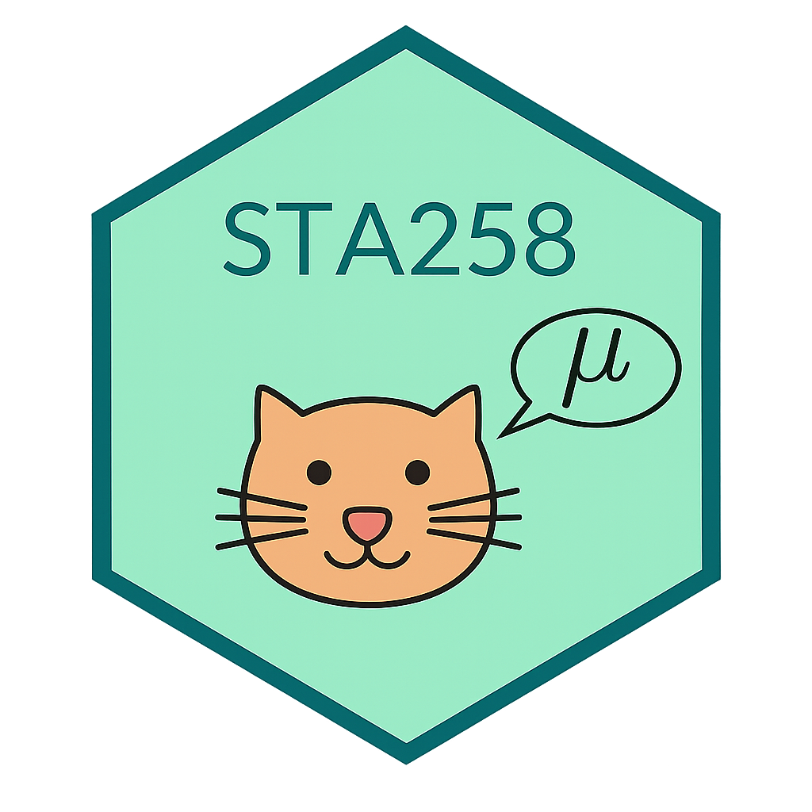

# Chapter 2: An Introduction to R {.title-slide}

<style>
:root {
  --sta-teal:        #00695c;
  --sta-teal-dark:   #004d40;
  --sta-teal-light:  #e0f2f1;
  --sta-blue:        #c8e6f3;
  --sta-blue-soft:   #eef8fb;
  --sta-grey:        #f5f6f7;
  --sta-yellow:      #fff8e1;
  --sta-orange:      #f9a825;
  --sta-text:        #2f3437;
  --sta-muted:       #667174;
  --sta-border:      #d8dee2;
  --sta-code:        #f3f4f5;
}

/* ── Base ─────────────────────────────────────────────── */
.reveal {
  font-family: Arial, sans-serif;
  color: var(--sta-text);
}
.reveal .slides section {
  text-align: left;
  padding: 18px 30px;
  box-sizing: border-box;
}
.reveal h1, .reveal h2, .reveal h3 {
  color: var(--sta-text);
  line-height: 1.1;
}
.reveal h1  { font-size: 1.72em !important; }
.reveal h2  {
  font-size: 1.6em !important;
  border-bottom: 3px solid var(--sta-teal);
  padding-bottom: 4px;
  margin-bottom: 12px;
}
.reveal h3  { font-size: 1.1em !important; margin-bottom: 0.2em; }
.reveal p, .reveal li { font-size: 0.78em; line-height: 1.35; }

/* ── Title slide ──────────────────────────────────────── */
.title-slide { text-align: center !important; }
.title-slide h1 { font-size: 1.72em !important; margin-top: 0.4em; }
.title-slide p  { font-size: 0.78em; color: var(--sta-muted); }

/* ── Grid layouts ─────────────────────────────────────── */
.two-col, .two-col-lean, .two-col-wide,
.three-col, .four-grid, .web-grid, .exercise-grid {
  display: grid;
  gap: 14px;
  align-items: start;
}
.two-col       { grid-template-columns: 1fr 1fr; }
.two-col-lean  { grid-template-columns: 0.95fr 1.05fr; }
.two-col-wide  { grid-template-columns: 1.1fr 0.9fr; }
.three-col     { grid-template-columns: repeat(3, 1fr); }
.four-grid     { grid-template-columns: repeat(2, 1fr); }
.web-grid      { grid-template-columns: 270px 1fr; }
.exercise-grid { grid-template-columns: 340px 1fr; gap: 16px; }
.col           { min-width: 0; }
.install-panel { display: flex; flex-direction: column; gap: 10px; }

/* ── Boxes ────────────────────────────────────────────── */
.defbox, .examplebox, .thinkbox, .card,
.warnbox, .taskbox, .notebox, .mini-card, .stat-card {
  padding: 12px 15px;
  border-radius: 10px;
  font-size: 0.74em;
  line-height: 1.28;
  box-sizing: border-box;
}
.defbox, .card {
  background: linear-gradient(160deg, var(--sta-blue), var(--sta-blue-soft));
  border-left: 7px solid var(--sta-teal);
}
.examplebox, .notebox, .mini-card {
  background: var(--sta-grey);
  border: 1px solid var(--sta-border);
}
.thinkbox, .taskbox {
  background: var(--sta-yellow);
  border-left: 7px solid var(--sta-orange);
}
.warnbox {
  background: #fff3e0;
  border-left: 7px solid #ef6c00;
}
.stat-card {
  background: white;
  border: 1px solid var(--sta-border);
  box-shadow: 0 1px 4px rgba(0,0,0,0.07);
}
.card .label, .taskbox .label, .notebox .label,
.mini-card .label, .stat-card .label {
  display: block;
  color: var(--sta-teal-dark);
  font-weight: 700;
  margin-bottom: 5px;
}

/* ── Utility ──────────────────────────────────────────── */
.big        { font-size: 1.08em; font-weight: bold; color: var(--sta-teal); }
.center     { text-align: center; }
.small-text { font-size: 0.64em; }
.tight li   { margin-bottom: 0.18em; }
.formula {
  display: inline-block;
  background: white;
  border: 1px solid var(--sta-border);
  border-radius: 8px;
  padding: 5px 10px;
  font-family: "SFMono-Regular", Consolas, monospace;
  font-size: 1.06em;
}

/* ── Tables ───────────────────────────────────────────── */
.reveal table { width: 100%; border-collapse: collapse; font-size: 0.66em; }
.reveal th, .reveal td {
  border: 1px solid var(--sta-border);
  padding: 7px 10px;
  vertical-align: top;
}
.reveal th { background: var(--sta-teal-light); font-weight: bold; }

/* ── Code ─────────────────────────────────────────────── */
.reveal pre {
  width: 100%;
  margin-top: 0.3em;
  margin-bottom: 0.3em;
  border-radius: 8px;
}
.reveal pre code { font-size: 0.75em; max-height: 340px; }
.reveal code {
  background: var(--sta-code);
  border-radius: 4px;
  padding: 1px 4px;
}

/* ── Compact ──────────────────────────────────────────── */
.reveal section.compact h2  { font-size: 1.1em !important; }
.reveal section.compact p,
.reveal section.compact li  { font-size: 0.74em; }

/* ── Web slides ───────────────────────────────────────── */
.reveal section.web-slide h2 { font-size: 1.12em !important; margin-bottom: 0.3em; }
.button-link {
  display: block !important;
  background: var(--sta-teal) !important;
  background-color: var(--sta-teal) !important;
  color: white !important;
  padding: 10px 13px !important;
  border-radius: 9px !important;
  text-decoration: none !important;
  font-weight: bold !important;
  font-size: 0.74em !important;
  text-align: center !important;
  opacity: 1 !important;
  visibility: visible !important;
  border: 2px solid var(--sta-teal-dark) !important;
}
.button-link:hover {
  background: var(--sta-teal-dark) !important;
  background-color: var(--sta-teal-dark) !important;
}

.web-slide .examplebox,
.web-slide .thinkbox,
.web-slide .warnbox { font-size: 0.66em; line-height: 1.24; padding: 10px 12px; }

/*
 * frame-wrap: visible container.
 * iframe scaled to 80% → 125% × 0.8 = 100% in both dimensions.
 */
.frame-wrap {
  width: 100%;
  height: 470px;
  border: 2px solid var(--sta-border);
  border-radius: 9px;
  overflow: hidden;
  background: #fff;
}
.frame-wrap iframe {
  width: 125%;
  height: 125%;
  border: 0;
  transform: scale(0.8);
  transform-origin: 0 0;
}

/* ── Solution callouts ────────────────────────────────── */
.callout { font-size: 0.75em; }
</style>



STA258: Statistics with Applied Probability  
University of Toronto Mississauga

{width="245" fig-alt="Course mascot"}

---

## Chapter Roadmap {.compact}

:::: {.three-col}
::: {.card .fragment}
<span class="label">1 - Setup</span>
Install R and RStudio, understand the four RStudio panes, and learn about Positron.
:::
::: {.card .fragment}
<span class="label">2 - R Basics</span>
Use R as a calculator, create variables, build vectors, and apply common built-in functions.
:::
::: {.card .fragment}
<span class="label">3 - Data Work</span>
Read data frames, select rows and columns, make histograms, and use ggplot2.
:::
::::

<br>

:::: {.three-col}
::: {.stat-card .fragment}
<span class="label">Core skill</span>
Writing commands that make statistical work clear and repeatable.
:::
::: {.stat-card .fragment}
<span class="label">Core tool</span>
RStudio - scripts, output, plots, and help pages in one place.
:::
::: {.stat-card .fragment}
<span class="label">Core habit</span>
Save work in scripts rather than relying on the Console alone.
:::
::::

---

## 2.1 What is R? {#statistical-computing-language}

::: {.defbox .fragment}
**R**

R is used for data manipulation, statistics, and graphics. It supports a wide range of operations (`+`, `−`, `/`, `<`, etc.) on vectors, arrays, and matrices, and includes a large collection of built-in functions and user-contributed packages.
:::

<br>

:::: {.three-col}
::: {.stat-card .fragment}
<span class="label">Free</span>
Open-source and free to install on any platform.
:::
::: {.stat-card .fragment}
<span class="label">Vast</span>
20,000+ contributed packages on CRAN.
:::
::: {.stat-card .fragment}
<span class="label">Speaks Many Languages</span>
Interfaces with C, C++, FORTRAN, Python, and SQL.
:::
::::

---

## 2.1 Why Scripts, Not Clicks?

::: {.examplebox .fragment}
**Point-and-click vs scripting**

Point-and-click tools are useful for quick work, but the steps behind the result can be hard to review or repeat.
:::

<br>

:::: {.two-col}
::: {.mini-card .fragment}
<span class="label">Click workflow</span>
Open menu → choose options → click Run. Six months later: which options did you pick?
:::
::: {.mini-card .fragment}
<span class="label">Script workflow</span>
`mean(marks)` saved to a `.R` file. Re-run on new data with one keystroke.
:::
::::

<br>

::: {.thinkbox .fragment}
**Why scripts matter**

R lets us write scripts that document each step of an analysis. This promotes **reproducibility**, version control, and transparency - analyses can be automated, customised, and rerun on new data with minimal effort.
:::

---

## 2.2 Installing R and RStudio {#installing-r-and-rstudio}

:::: {.two-col}
::: {.defbox .fragment}
**R**

The programming language that performs the calculations.

**Install this first.**
:::
::: {.defbox .fragment}
**RStudio**

The interface for writing scripts, running code, viewing plots, and managing files.

**Install this second.**
:::
::::

<br>

::: {.thinkbox .fragment}
RStudio is the interface but R does the computation - R must be installed first. The next two slides walk through each install.
:::

---

## 2.2.1 Installing R: CRAN {.web-slide}

:::: {.web-grid}
::: {.install-panel}
::: {.examplebox .tight .nonincremental}
**Install R:**

1. Open CRAN.
2. Choose Windows, macOS, or Linux.
3. Download the installer.
4. Use the default installation settings.
:::

::: {.thinkbox}
If the page below does not load, use the button to open the official site directly.
:::

[Open CRAN in New Tab](https://cran.r-project.org/){.button-link target="_blank" rel="noopener"}
:::

::: {.frame-wrap}
<iframe src="https://cran.r-project.org/" loading="lazy" title="CRAN - Comprehensive R Archive Network"></iframe>
:::
::::

---

## 2.2.2 Installing RStudio {.web-slide}

:::: {.web-grid}
::: {.install-panel}
::: {.examplebox .tight .nonincremental}
**Install RStudio Desktop:**

1. Open the Posit download page.
2. Choose RStudio Desktop (free).
3. Download the installer for your OS.
4. Run the installer.
5. Open RStudio and check the Console.
:::

::: {.thinkbox}
RStudio auto-detects R if R was installed first.
:::

[Open RStudio Download](https://posit.co/download/rstudio-desktop/){.button-link target="_blank" rel="noopener"}
:::

::: {.frame-wrap}
<iframe src="https://web.archive.org/web/2024if_/https://posit.co/download/rstudio-desktop/" loading="lazy" title="Posit - RStudio Desktop download"></iframe>
:::
::::

---

## 2.2.3 Positron {.compact}

:::: {.two-col-lean}
::: {.col}
::: {.defbox .fragment}
**What is Positron?**

Positron is a cross-platform desktop IDE developed by **Posit PBC** (formerly RStudio). It is built on the **Visual Studio Code** architecture and powered by **Electron**, and runs on Windows, macOS, and Linux.

It supports R, Python, JavaScript, and Quarto documents.

Download: [positron.posit.co](https://positron.posit.co)
:::
:::

::: {.col}
::: {.examplebox .fragment}
**RStudio and Posit**

RStudio is maintained by Posit, a company that also develops Shiny, Quarto, and R Markdown.
:::

<br>

::: {.thinkbox .fragment}
Positron is not required for this course. RStudio is the standard tool. Positron may become relevant in future workflows involving collaborative or browser-based coding.
:::
:::
::::

---

## RStudio Panes {#rstudio-panes}

:::: {.four-grid}
::: {.card .fragment}
<span class="label">Source</span>
Write and save R scripts, R Markdown, and Quarto files here.
:::
::: {.card .fragment}
<span class="label">Console</span>
Run commands and see immediate output, messages, and errors.
:::
::: {.card .fragment}
<span class="label">Environment / History</span>
View objects currently in memory and commands that have been run.
:::
::: {.card .fragment}
<span class="label">Files / Plots / Packages / Help</span>
Manage files, view plots, load packages, and read help pages.
:::
::::

<br>

:::: {.three-col}
::: {.mini-card .fragment}
<span class="label">Write</span>
Type commands in the Source pane so the work is saved.
:::
::: {.mini-card .fragment}
<span class="label">Run</span>
`Cmd + Enter` (Mac) or `Ctrl + Enter` (Windows).
:::
::: {.mini-card .fragment}
<span class="label">Check</span>
Inspect objects, plots, and help pages using the other panes.
:::
::::

---

## 2.3 An Introduction to Programming in R {.compact}

**Why R for statistics?**

- Built specifically for data analysis, statistics, and visualization
- Rich ecosystem of packages and built-in statistical functions
- Open source and free on every major operating system
- Strong support for reproducible reporting through R Markdown and Quarto
- Widely used in academia, industry, and government

---

## 2.3.1 R as a Powerful Calculator {#calculator}

:::: {.two-col-lean}
::: {.col}
```{webr}
#| autorun: false

2 + 3        # addition
4 - 1        # subtraction
6 * 2        # multiplication
8 / 2        # division
5^2          # exponentiation
```
:::

::: {.col}
| Symbol | Meaning |
|---|---|
| `+` | Add |
| `-` | Subtract |
| `*` | Multiply |
| `/` | Divide |
| `^` | Power |

::: {.thinkbox}
R follows standard order of operations. Use parentheses to control evaluation.
:::
:::
::::

---

## More Operators {.compact}

:::: {.two-col-lean}
::: {.col}
```{webr}
#| autorun: false

9 %% 4              # remainder
9 %/% 4             # integer division
sqrt(16)            # square root
round(3.14159, 2)   # round to 2 decimals
abs(-10)            # absolute value
```
:::

::: {.col}
::: {.examplebox}
`9 %% 4` → remainder after dividing 9 by 4.

`9 %/% 4` → how many complete 4s fit into 9.

`sqrt()`, `round()`, and `abs()` take inputs inside parentheses - these are **function calls**.
:::
:::
::::

---

## Calculator Practice

::::: {.exercise-grid}
:::: {.taskbox}
<span class="label">Task</span>
Translate this math expression into R and evaluate it:

<span class="formula">(12 + 8) ÷ 5</span>

<br>

Then try: <span class="formula">3<sup>4</sup> − √25</span>
::::

:::: {.col}
```{webr}
#| exercise: calculator-practice

# write your R code here

```

::: {.solution exercise="calculator-practice"}
::: {.callout-tip title="Solution"}
```r
(12 + 8) / 5
3^4 - sqrt(25)
```
:::
:::
::::
:::::

---

## Declaring Variables {#variables}

:::: {.two-col-lean}
::: {.col}
```{webr}
#| autorun: false

x <- 10
y <- 5

x
y
x + y
```
:::

::: {.col}
::: {.defbox}
**Variable**

A variable stores a value so it can be reused later. The assignment arrow `<-` means "store the value on the right in the name on the left."
:::
:::
::::

---

## Variable Practice

::::: {.exercise-grid}
:::: {.taskbox}
<span class="label">Task</span>
Create a variable called `mark` storing the value `87`, then display it.
::::

:::: {.col}
```{webr}
#| exercise: variable-practice

mark <- 0

mark
```

::: {.solution exercise="variable-practice"}
::: {.callout-tip title="Solution"}
```r
mark <- 87

mark
```
:::
:::
::::
:::::

---

## 2.3.2 Basic R Data Structures {.compact}

The primary data structures in R are **vectors**, **lists**, **matrices**, **arrays**, **factors**, and **data frames**.

| Structure | Stores | Dimensions | Types mixed? |
|---|---|---|---|
| Vector | One type of value | 1-D | No |
| List | Any types | 1-D | Yes |
| Matrix | One type of value | 2-D | No |
| Array | One type of value | n-D | No |
| Factor | Categorical values | 1-D | No |
| Data frame | Any types per column | 2-D | Yes |

::: {.thinkbox .fragment}
For most applied statistics the main structure is the **data frame**, because it resembles a spreadsheet where each column can hold a different type.
:::

---

## Vectors {#vectors}

:::: {.two-col-lean}
::: {.col}
```{webr}
#| autorun: false

# Assigning a vector
v <- c(1, 2, 3, 4, 5)
v

# A vector of marks
marks <- c(80, 75, 90, 88, 92)
mean(marks)
length(marks)
```
:::

::: {.col}
::: {.defbox}
**Numeric vector**

A vector stores multiple values of the same type in one object. The function `c()` combines values.

`mean()` computes the average; `length()` counts the elements.
:::
:::
::::

---

## Vector Practice

::::: {.exercise-grid}
:::: {.taskbox}
<span class="label">Task</span>
Create a vector `temps` with:

<span class="formula">21, 23, 20, 25, 24</span>

Then compute its mean.
::::

:::: {.col}
```{webr}
#| exercise: vector-practice

temps <- c(0, 0, 0, 0, 0)

mean(temps)
```

::: {.solution exercise="vector-practice"}
::: {.callout-tip title="Solution"}
```r
temps <- c(21, 23, 20, 25, 24)

mean(temps)
```
:::
:::
::::
:::::

---

## Indexing from a Vector

:::: {.two-col-lean}
::: {.col}
```{webr}
#| autorun: false

marks <- c(80, 75, 90, 88, 92)

marks[1]          # first element
marks[3]          # third element
marks[2:4]        # second to fourth
marks[c(1, 5)]    # first and fifth
```
:::

::: {.col}
::: {.defbox}
**Indexing**

Square brackets `[ ]` select elements by position.

R starts counting at **1**, not 0.

`2:4` creates the sequence 2, 3, 4.
:::
:::
::::

---

## Vector Indexing Practice

::::: {.exercise-grid}
:::: {.taskbox}
<span class="label">Task</span>
Extract the **second** and **fourth** values from `marks`.
::::

:::: {.col}
```{webr}
#| exercise: indexing-practice

marks <- c(80, 75, 90, 88, 92)

marks[c(1, 1)]
```

::: {.solution exercise="indexing-practice"}
::: {.callout-tip title="Solution"}
```r
marks <- c(80, 75, 90, 88, 92)

marks[c(2, 4)]
```
:::
:::
::::
:::::

---

## Lists

:::: {.two-col-lean}
::: {.col}
```{webr}
#| autorun: false

# A list can store different types
my_list <- list(
  name   = "Alice",
  age    = 25,
  scores = c(90, 85, 88),
  passed = TRUE
)

my_list$name          # access by name
my_list[[2]]          # access by index
my_list[["scores"]]   # access by key

my_list$age       <- 26         # modify element
my_list$new_field <- "Added!"   # add new element
my_list
```
:::

::: {.col}
::: {.defbox}
**List**

A list stores elements of **different types** in one object - unlike a vector, which requires all elements to be the same type.

Lists are used to organise complex or mixed data, and are the building block for data frames.
:::
:::
::::

---

## Matrices

:::: {.two-col-lean}
::: {.col}
```{webr}
#| autorun: false

# A matrix is a 2-D array of one type
m <- matrix(c(1, 2, 3, 4), nrow = 2)
m

m[1, 2]    # row 1, column 2
t(m)       # transpose
det(m)     # determinant
```
:::

::: {.col}
::: {.defbox}
**Matrix**

A matrix is a two-dimensional data structure storing elements of the same type. It supports addition, multiplication, transposition, and inversion.

Used in linear algebra, statistics, and data analysis.
:::
:::
::::

---

## Arrays and Factors

:::: {.two-col}
::: {.col}
```{webr}
#| autorun: false

# Create a 3-D array (2 rows × 3 columns × 2 layers)
a <- array(1:12, dim = c(2, 3, 2))

a[1, 2, 1]    # row 1, column 2, layer 1
a[ , , 2]     # all rows and columns in layer 2
```
:::

::: {.col}
```{webr}
#| autorun: false

# Factors store categorical values with levels
gender <- factor(c("Male", "Female", "Female", "Male"))

gender
levels(gender)   # [1] "Female" "Male"
```
:::
::::

<br>

:::: {.two-col}
::: {.examplebox}
**Arrays** extend matrices to n dimensions. Useful for simulations and higher-dimensional data.
:::
::: {.examplebox}
**Factors** store unique values (called **levels**) efficiently. Automatically treated as categorical in models.
:::
::::

---

## Reading CSV-Style Data {#data-frames}

:::: {.two-col-lean}
::: {.col}
```{webr}
#| autorun: false

csv_text <- "student,mark,hours
A,80,6
B,75,5
C,90,8
D,88,7"

class_data <- read.csv(text = csv_text)
class_data
```
:::

::: {.col}
::: {.defbox}
**Data frame**

A data frame is a table where each **row** is one observation and each **column** is one variable. Columns can hold different types.

`read.csv()` reads comma-separated data into a data frame.
:::
:::
::::

---

## Data Frame Basics

:::: {.two-col-lean}
::: {.col}
```{webr}
#| autorun: false

csv_text <- "student,mark,hours
A,80,6
B,75,5
C,90,8
D,88,7"

class_data <- read.csv(text = csv_text)

head(class_data)    # first rows
dim(class_data)     # rows × columns
names(class_data)   # column names
```
:::

::: {.col}
| Command | What it does |
|---|---|
| `head()` | View first rows |
| `dim()` | Count rows and columns |
| `names()` | List column names |
| `summary()` | Summary statistics |

::: {.thinkbox}
Run these checks whenever you open a new dataset.
:::
:::
::::

---

## Isolating Columns and Rows

:::: {.two-col-lean}
::: {.col}
```{webr}
#| autorun: false

csv_text <- "student,mark,hours
A,80,6
B,75,5
C,90,8
D,88,7"

class_data <- read.csv(text = csv_text)

class_data$mark                       # one column
mean(class_data$mark)                 # mean of a column
class_data[1:2, c("student","mark")]  # rows and columns
```
:::

::: {.col}
::: {.examplebox}
**Two selection methods**

`data$column` - select a column by name (returns a vector).

`data[row, column]` - select rows and columns by position or name.
:::
:::
::::

---

## Column Practice

::::: {.exercise-grid}
:::: {.taskbox}
<span class="label">Task</span>
Find the average number of study hours.
::::

:::: {.col}
```{webr}
#| exercise: column-practice

csv_text <- "student,mark,hours
A,80,6
B,75,5
C,90,8
D,88,7"

class_data <- read.csv(text = csv_text)

mean(class_data$mark)
```

::: {.solution exercise="column-practice"}
::: {.callout-tip title="Solution"}
```r
csv_text <- "student,mark,hours
A,80,6
B,75,5
C,90,8
D,88,7"

class_data <- read.csv(text = csv_text)

mean(class_data$hours)
```
:::
:::
::::
:::::

---

## Row and Column Practice

::::: {.exercise-grid}
:::: {.taskbox}
<span class="label">Task</span>
Select the **first two rows** and only the `student` and `mark` columns.
::::

:::: {.col}
```{webr}
#| exercise: row-column-practice

csv_text <- "student,mark,hours
A,80,6
B,75,5
C,90,8
D,88,7"

class_data <- read.csv(text = csv_text)

class_data[1:3, c("mark", "hours")]
```

::: {.solution exercise="row-column-practice"}
::: {.callout-tip title="Solution"}
```r
csv_text <- "student,mark,hours
A,80,6
B,75,5
C,90,8
D,88,7"

class_data <- read.csv(text = csv_text)

class_data[1:2, c("student", "mark")]
```
:::
:::
::::
:::::

---

## 2.3.3 Using Basic Functions in R {.compact}

:::: {.two-col-lean}
::: {.col}
```{webr}
#| autorun: false

x <- c(10, 3, 8, 25, 7)

# Find the maximum and minimum values
max(x)
min(x)

# Sort the vector
sort(x)                       # ascending order
sort(x, decreasing = TRUE)    # descending order

# Find the order (ranks) of elements
order(x)
```
:::

::: {.col}
| Function | Purpose |
|---|---|
| `max()`, `min()` | Largest and smallest values |
| `mean()`, `sum()` | Average and total |
| `sort()` | Sorted values |
| `order()` | Rank positions |

::: {.thinkbox}
These functions work on vectors, and many also apply to data-frame columns or matrices with additional arguments.
:::
:::
::::

---

## 2.3.4 Histogram: the `faithful` Dataset {.compact}

:::: {.two-col-lean}
::: {.col}
```{webr}
#| autorun: false

data(faithful)

# Step 1 - check the variable names
names(faithful)

# Step 2 - create a basic histogram
hist(faithful$waiting)
```
:::

::: {.col}
::: {.defbox}
**`faithful`**

A built-in R dataset recording Old Faithful geyser eruptions. It has two numeric variables: eruption duration and waiting time between eruptions.
:::

<br>

::: {.examplebox}
A histogram groups values into intervals and shows how many observations fall in each interval.
:::
:::
::::

---

## Histogram Components

:::: {.two-col-lean}
::: {.col}
```{webr}
#| autorun: false

data(faithful)

# Step 3 - add labels and colour
hist(
  faithful$waiting,
  main   = "Waiting Time Between Eruptions",
  xlab   = "Waiting time (minutes)",
  col    = "lightblue",
  border = "white"
)

# Step 4 - inspect numeric components without drawing
hist(faithful$waiting, plot = FALSE)$breaks   # interval endpoints
hist(faithful$waiting, plot = FALSE)$counts   # counts per interval
```
:::

::: {.col}
::: {.thinkbox}
`plot = FALSE` suppresses the graph and returns the underlying values - useful for checking breakpoints and counts directly.
:::
:::
::::

---

## Histogram Practice

::::: {.exercise-grid}
:::: {.taskbox}
<span class="label">Task</span>
Change the histogram to show **eruption duration** instead of waiting time. Update the title and x-axis label.
::::

:::: {.col}
```{webr}
#| exercise: histogram-practice

data(faithful)

hist(
  faithful$waiting,
  main   = "Waiting Time Between Eruptions",
  xlab   = "Waiting time (minutes)",
  col    = "lightblue",
  border = "white"
)
```

::: {.solution exercise="histogram-practice"}
::: {.callout-tip title="Solution"}
```r
data(faithful)

hist(
  faithful$eruptions,
  main   = "Duration of Old Faithful Eruptions",
  xlab   = "Eruption duration (minutes)",
  col    = "lightblue",
  border = "white"
)
```
:::
:::
::::
:::::

---

## 2.3.5 Installing and Loading Packages {#packages}

:::: {.two-col-lean}
::: {.col}
```r
# 1. Install once (downloads from CRAN)
install.packages("ggplot2")
install.packages("tidyverse")

# 2. Load every session
library(ggplot2)
library(tidyverse)   # loads dplyr, tidyr,
                     # readr, purrr, and more

# View all installed packages
installed.packages()

# Search for packages by keyword
help.search("regression")
```
:::

::: {.col}
::: {.defbox .fragment}
**Packages**

R packages provide specialised functions stored on CRAN (the Comprehensive R Archive Network), which you accessed when installing R.

Install a package once with `install.packages()`, then load it each session with `library()`.
:::

::: {.examplebox .fragment}
**tidyverse**

A meta-package that bundles `ggplot2` (plots), `dplyr` (filter/select/mutate), `tidyr`, `readr`, `purrr`, and others. One install, one library call, the full data-science toolkit.
:::
:::
::::

---

## Using ggplot2 {.compact}

:::: {.two-col-lean}
::: {.col}
```{webr}
#| autorun: false

library(ggplot2)

csv_text <- "student,mark,hours
A,80,6
B,75,5
C,90,8
D,88,7"

class_data <- read.csv(text = csv_text)

ggplot(class_data, aes(x = hours, y = mark)) +
  geom_point(size = 4, colour = "#00695c") +
  labs(
    title = "Study Hours and Marks",
    x     = "Study hours",
    y     = "Mark"
  ) +
  theme_minimal(base_size = 14)
```
:::

::: {.col}
::: {.examplebox}
**ggplot2 structure**

`ggplot()` - start the plot.

`aes()` - map variables to axes.

`geom_point()` - choose the plot type.

`labs()` - add labels.

`theme_minimal()` - clean background.
:::
:::
::::

---

## Using tidyverse: `dplyr` {.compact}

:::: {.two-col-lean}
::: {.col}
```{webr}
#| autorun: false

library(dplyr)

csv_text <- "student,mark,hours
A,80,6
B,75,5
C,90,8
D,88,7
E,62,3"

class_data <- read.csv(text = csv_text)

class_data |>
  filter(mark >= 80) |>
  select(student, mark) |>
  arrange(desc(mark))
```
:::

::: {.col}
::: {.examplebox}
**dplyr verbs**

`filter()` - keep rows that match a condition.

`select()` - keep only the columns you name.

`arrange()` - sort rows by one or more columns.

The pipe `|>` (or `%>%`) chains verbs together: read it as "then".
:::
:::
::::

---

## ggplot2 Practice

::::: {.exercise-grid}
:::: {.taskbox}
<span class="label">Task</span>
Change the plot so the x-axis shows `student` and the y-axis shows `mark`, using a bar chart instead of points.

Hint: replace `geom_point()` with `geom_col()`.
::::

:::: {.col}
```{webr}
#| exercise: ggplot-practice

library(ggplot2)

csv_text <- "student,mark,hours
A,80,6
B,75,5
C,90,8
D,88,7"

class_data <- read.csv(text = csv_text)

ggplot(class_data, aes(x = hours, y = mark)) +
  geom_point(size = 4, colour = "#00695c") +
  labs(
    title = "Study Hours and Marks",
    x     = "Study hours",
    y     = "Mark"
  ) +
  theme_minimal(base_size = 14)
```

::: {.solution exercise="ggplot-practice"}
::: {.callout-tip title="Solution"}
```r
library(ggplot2)

csv_text <- "student,mark,hours
A,80,6
B,75,5
C,90,8
D,88,7"

class_data <- read.csv(text = csv_text)

ggplot(class_data, aes(x = student, y = mark)) +
  geom_col(fill = "#00695c") +
  labs(
    title = "Marks by Student",
    x     = "Student",
    y     = "Mark"
  ) +
  theme_minimal(base_size = 14)
```
:::
:::
::::
:::::

---

## Chapter 2 Summary {.compact}

:::: {.four-grid}
::: {.card .fragment}
<span class="label">R</span>
Open-source language for statistics, graphics, and reproducible analysis. Interfaces with C, C++, and FORTRAN. Freely available from CRAN.
:::
::: {.card .fragment}
<span class="label">RStudio</span>
The main interface for writing and running R code. Four panes: Source, Console, Environment/History, Files/Plots/Help.
:::
::: {.card .fragment}
<span class="label">Data Structures</span>
Vector, list, matrix, array, factor, data frame. The data frame is the most common structure in applied statistics.
:::
::: {.card .fragment}
<span class="label">Indexing</span>
`v[i]` for vectors. `df[row, col]` for data frames. `df$col` to extract a column. R counts from 1.
:::
::::

<br>

:::: {.three-col}
::: {.mini-card .fragment}
<span class="label">Functions</span>
`mean()`, `max()`, `min()`, `sort()`, `order()`, `hist()`, `names()`, `dim()`, `head()`, `summary()`
:::
::: {.mini-card .fragment}
<span class="label">Packages</span>
`install.packages()` once. `library()` every session. `installed.packages()` to list. `help.search()` to find.
:::
::: {.mini-card .fragment}
<span class="label">ggplot2</span>
`ggplot()` + `aes()` + `geom_*()` + `labs()` builds professional labelled plots.
:::
::::

---

## End of Chapter 2

::: {.center}
<span class="big">End of Chapter 2</span>

<br><br>

[Back to Home](test.html){.button-link}
:::